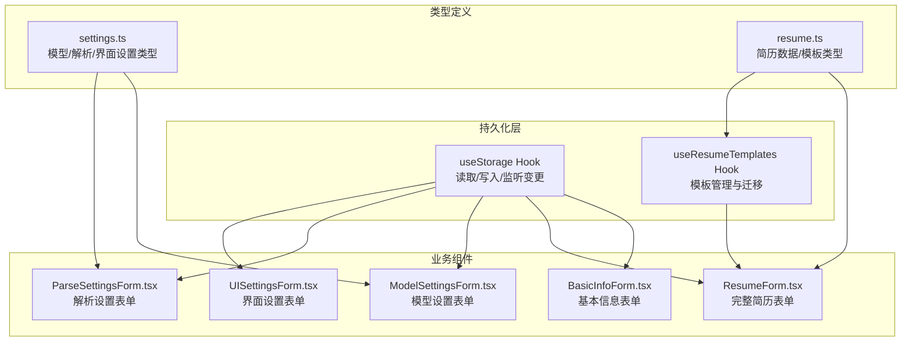
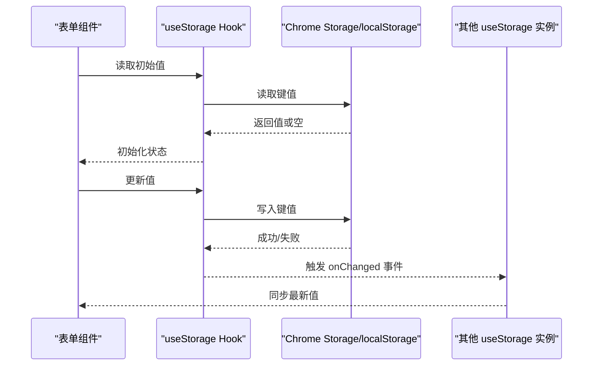
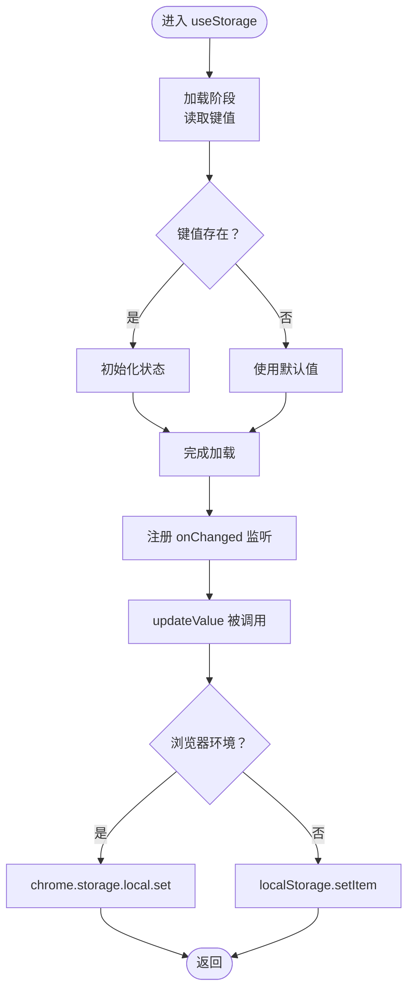
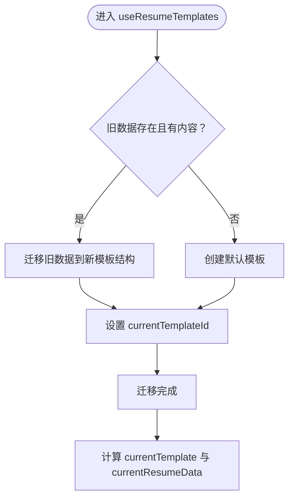
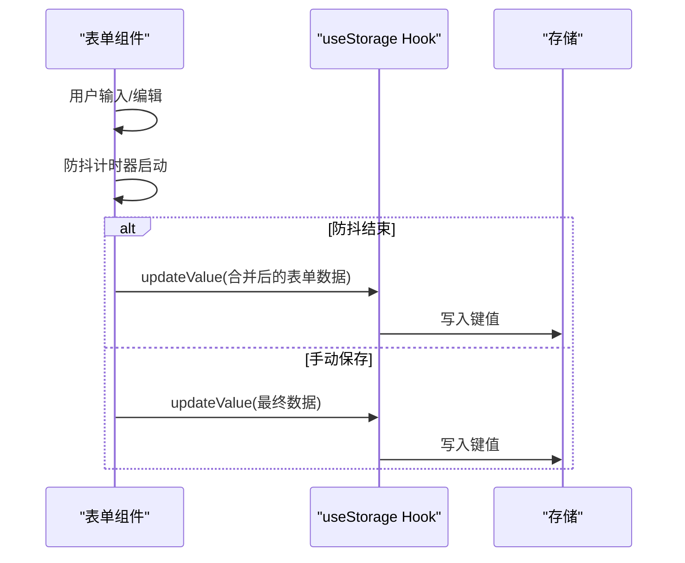
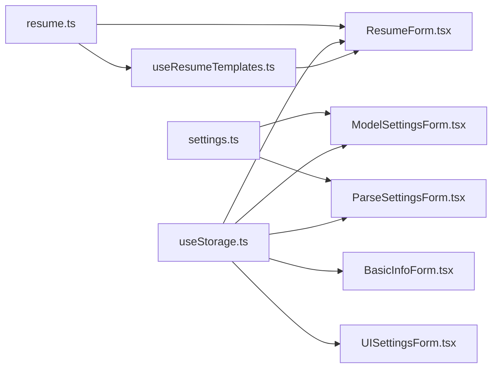

# 数据持久化

<cite>
**本文引用的文件**
- [useStorage.ts](file://src/hooks/useStorage.ts)
- [useResumeTemplates.ts](file://src/hooks/useResumeTemplates.ts)
- [settings.ts](file://src/types/settings.ts)
- [resume.ts](file://src/types/resume.ts)
- [BasicInfoForm.tsx](file://src/features/popup/BasicInfoForm.tsx)
- [ResumeForm.tsx](file://src/features/popup/ResumeForm.tsx)
- [ModelSettingsForm.tsx](file://src/features/popup/settings/ModelSettingsForm.tsx)
- [ParseSettingsForm.tsx](file://src/features/popup/settings/ParseSettingsForm.tsx)
- [UISettingsForm.tsx](file://src/features/popup/settings/UISettingsForm.tsx)
</cite>

## 目录
1. [简介](#简介)
2. [项目结构](#项目结构)
3. [核心组件](#核心组件)
4. [架构总览](#架构总览)
5. [详细组件分析](#详细组件分析)
6. [依赖关系分析](#依赖关系分析)
7. [性能考量](#性能考量)
8. [故障排查指南](#故障排查指南)
9. [结论](#结论)
10. [附录](#附录)

## 简介
本文件围绕数据持久化机制展开，重点阐述自定义 Hook useStorage 如何封装 Chrome Storage API，实现简历数据与用户设置的自动保存与恢复；解释数据序列化与反序列化的流程；说明存储配额限制与异步读写冲突的处理策略；梳理自动保存的触发时机与手动保存的操作流程；给出错误处理与降级方案，并指导如何扩展存储结构与迁移旧版本数据。

## 项目结构
数据持久化相关的核心代码集中在以下模块：
- 自定义 Hook：useStorage.ts 封装 Chrome Storage API，提供统一的读取、写入与跨实例同步能力
- 模板系统：useResumeTemplates.ts 负责简历模板的 CRUD 与旧数据迁移
- 类型定义：settings.ts 与 resume.ts 定义了模型设置、界面设置、简历数据等结构
- 使用示例：各表单组件通过 useStorage 读写对应键值，实现自动保存与恢复

图表来源
- [useStorage.ts](file://src/hooks/useStorage.ts#L1-L101)
- [useResumeTemplates.ts](file://src/hooks/useResumeTemplates.ts#L1-L258)
- [settings.ts](file://src/types/settings.ts#L1-L192)
- [resume.ts](file://src/types/resume.ts#L1-L212)
- [BasicInfoForm.tsx](file://src/features/popup/BasicInfoForm.tsx#L1-L180)
- [ResumeForm.tsx](file://src/features/popup/ResumeForm.tsx#L1-L782)
- [ModelSettingsForm.tsx](file://src/features/popup/settings/ModelSettingsForm.tsx#L1-L298)
- [ParseSettingsForm.tsx](file://src/features/popup/settings/ParseSettingsForm.tsx#L1-L99)
- [UISettingsForm.tsx](file://src/features/popup/settings/UISettingsForm.tsx#L1-L115)

章节来源
- [useStorage.ts](file://src/hooks/useStorage.ts#L1-L101)
- [useResumeTemplates.ts](file://src/hooks/useResumeTemplates.ts#L1-L258)
- [settings.ts](file://src/types/settings.ts#L1-L192)
- [resume.ts](file://src/types/resume.ts#L1-L212)

## 核心组件
- useStorage Hook：提供键值读取、写入、跨实例同步与开发环境降级
- useResumeTemplates Hook：提供模板 CRUD、当前模板数据访问、旧数据迁移
- 类型系统：settings.ts 与 resume.ts 定义了存储的数据结构与默认值

章节来源
- [useStorage.ts](file://src/hooks/useStorage.ts#L1-L101)
- [useResumeTemplates.ts](file://src/hooks/useResumeTemplates.ts#L1-L258)
- [settings.ts](file://src/types/settings.ts#L1-L192)
- [resume.ts](file://src/types/resume.ts#L1-L212)

## 架构总览
数据持久化采用“Hook + 键值”的分层设计：
- Hook 层：统一处理读取、写入、监听与降级
- 业务层：各表单组件通过 Hook 读写对应键值，实现自动保存与恢复
- 类型层：通过强类型约束保证数据结构一致性

图表来源
- [useStorage.ts](file://src/hooks/useStorage.ts#L1-L101)

## 详细组件分析

### useStorage Hook 分析
- 读取流程：首次挂载时从 chrome.storage.local 或开发环境的 localStorage 读取指定键值；若存在则初始化状态，否则使用默认值
- 监听变更：注册 onChanged 监听器，当同一存储区域内的键发生变化时，同步更新当前实例的状态
- 写入流程：通过 updateValue 回调异步写入；开发环境下降级到 localStorage
- 错误处理：读取与写入均包含 try/catch 并记录错误日志，避免中断 UI

图表来源
- [useStorage.ts](file://src/hooks/useStorage.ts#L1-L101)

章节来源
- [useStorage.ts](file://src/hooks/useStorage.ts#L1-L101)

### 模板系统与旧数据迁移
- 模板存储键：RESUME_TEMPLATES
- 旧数据键：RESUME_DATA
- 迁移逻辑：当模板列表为空且检测到旧数据有内容时，将旧数据迁移到新模板结构；否则创建默认模板；若仅有模板但无当前模板 ID，则选中第一个
- 当前模板数据：通过 currentTemplateId 访问当前模板的简历数据

图表来源
- [useResumeTemplates.ts](file://src/hooks/useResumeTemplates.ts#L1-L258)
- [resume.ts](file://src/types/resume.ts#L1-L212)

章节来源
- [useResumeTemplates.ts](file://src/hooks/useResumeTemplates.ts#L1-L258)
- [resume.ts](file://src/types/resume.ts#L1-L212)

### 表单自动保存与手动保存
- 自动保存触发时机：
  - 基本信息表单：使用 react-hook-form 的 watch 监听表单值变化，防抖后写入存储
  - 完整简历表单：通过 isDirty 标记与定时器实现 500ms 防抖保存
- 手动保存：提交按钮显式触发一次写入，确保最终一致性
- 窗口失焦：当前实现未直接监听失焦事件，可通过在表单组件中添加 onBlur/onBlur 事件并调用 updateValue 达成

图表来源
- [BasicInfoForm.tsx](file://src/features/popup/BasicInfoForm.tsx#L1-L180)
- [ResumeForm.tsx](file://src/features/popup/ResumeForm.tsx#L1-L782)
- [useStorage.ts](file://src/hooks/useStorage.ts#L1-L101)

章节来源
- [BasicInfoForm.tsx](file://src/features/popup/BasicInfoForm.tsx#L1-L180)
- [ResumeForm.tsx](file://src/features/popup/ResumeForm.tsx#L1-L782)
- [useStorage.ts](file://src/hooks/useStorage.ts#L1-L101)

### 设置表单与存储键
- 模型设置：MODEL_SETTINGS
- 解析设置：PARSE_SETTINGS
- 界面设置：UI_SETTINGS
- 存储键常量集中定义，便于统一管理与扩展

章节来源
- [ModelSettingsForm.tsx](file://src/features/popup/settings/ModelSettingsForm.tsx#L1-L298)
- [ParseSettingsForm.tsx](file://src/features/popup/settings/ParseSettingsForm.tsx#L1-L99)
- [UISettingsForm.tsx](file://src/features/popup/settings/UISettingsForm.tsx#L1-L115)
- [useStorage.ts](file://src/hooks/useStorage.ts#L90-L101)

## 依赖关系分析
- useStorage 作为底层依赖被多个表单组件复用
- useResumeTemplates 依赖 useStorage 读写模板存储，并依赖 resume.ts 的类型定义
- settings.ts 为设置类表单提供类型与默认值
- 各表单组件通过 Hook 与类型系统协作，形成稳定的持久化闭环

图表来源
- [useStorage.ts](file://src/hooks/useStorage.ts#L1-L101)
- [useResumeTemplates.ts](file://src/hooks/useResumeTemplates.ts#L1-L258)
- [settings.ts](file://src/types/settings.ts#L1-L192)
- [resume.ts](file://src/types/resume.ts#L1-L212)
- [BasicInfoForm.tsx](file://src/features/popup/BasicInfoForm.tsx#L1-L180)
- [ResumeForm.tsx](file://src/features/popup/ResumeForm.tsx#L1-L782)
- [ModelSettingsForm.tsx](file://src/features/popup/settings/ModelSettingsForm.tsx#L1-L298)
- [ParseSettingsForm.tsx](file://src/features/popup/settings/ParseSettingsForm.tsx#L1-L99)
- [UISettingsForm.tsx](file://src/features/popup/settings/UISettingsForm.tsx#L1-L115)

## 性能考量
- 防抖策略：表单组件通过定时器减少频繁写入，降低存储压力与 UI 卡顿
- 读取优化：初次加载完成后，后续变更通过 onChanged 同步，避免重复读取
- 开发降级：开发环境使用 localStorage，避免构建环境差异导致的调试困难
- 类型约束：通过强类型定义减少运行期错误，提升稳定性

[本节为通用建议，不直接分析具体文件]

## 故障排查指南
- 读取失败：检查 chrome.storage 是否可用；若不可用，确认是否处于开发环境并使用 localStorage
- 写入失败：查看控制台错误日志；确认键值未超过存储配额
- 同步异常：确认 onChanged 监听是否正确注册与注销；避免重复监听导致内存泄漏
- 数据不一致：检查防抖时间与手动保存时机，确保最终写入覆盖中间状态

章节来源
- [useStorage.ts](file://src/hooks/useStorage.ts#L1-L101)

## 结论
本项目通过 useStorage Hook 将 Chrome Storage API 的复杂性封装在 Hook 内部，配合 useResumeTemplates 的模板系统与类型定义，实现了简历数据与用户设置的可靠持久化。自动保存与手动保存相结合，兼顾用户体验与数据一致性；开发降级与错误处理增强了健壮性。未来可在现有基础上扩展存储键、完善配额监控与冲突处理，并引入更细粒度的增量更新策略。

[本节为总结性内容，不直接分析具体文件]

## 附录

### 数据序列化与反序列化
- 写入时：将对象序列化为字符串（开发环境）或直接写入对象（生产环境）
- 读取时：从存储中还原为原对象结构
- 注意：对于复杂对象，需确保其可被安全序列化；必要时在类型层增加转换逻辑

章节来源
- [useStorage.ts](file://src/hooks/useStorage.ts#L1-L101)

### 存储配额限制与异步冲突
- 配额限制：Chrome Extension Storage 有大小限制，建议：
  - 控制单键体积，拆分为多个键或分批写入
  - 对大对象进行压缩或分片存储
  - 在写入前进行体积估算与提示
- 异步冲突：多实例同时写入可能产生竞态；建议：
  - 使用防抖与幂等写入
  - 在关键路径上加锁或版本号标记
  - 对写入失败进行重试与回退

章节来源
- [useStorage.ts](file://src/hooks/useStorage.ts#L1-L101)

### 自动保存与手动保存流程
- 自动保存：表单组件监听用户输入，经防抖后调用 updateValue 写入存储
- 手动保存：提交按钮触发最终写入，确保数据最终一致
- 窗口失焦：当前实现未直接监听失焦；可在表单组件中添加 onBlur/onBlur 事件并调用 updateValue

章节来源
- [BasicInfoForm.tsx](file://src/features/popup/BasicInfoForm.tsx#L1-L180)
- [ResumeForm.tsx](file://src/features/popup/ResumeForm.tsx#L1-L782)
- [useStorage.ts](file://src/hooks/useStorage.ts#L1-L101)

### 错误处理与降级方案
- 降级策略：当 chrome.storage 不可用时，自动切换到 localStorage
- 错误日志：捕获读取/写入异常并输出错误信息
- 失败重试：对关键写入操作可增加重试与回退策略

章节来源
- [useStorage.ts](file://src/hooks/useStorage.ts#L1-L101)

### 扩展存储结构与迁移旧版本
- 新增键：在 STORAGE_KEYS 中新增键名常量，并在相应表单中使用
- 迁移策略：参考 useResumeTemplates 的迁移逻辑，在 Hook 内部检测旧键并迁移至新结构
- 版本兼容：在类型定义中保留向后兼容字段，逐步淘汰旧字段

章节来源
- [useResumeTemplates.ts](file://src/hooks/useResumeTemplates.ts#L1-L258)
- [useStorage.ts](file://src/hooks/useStorage.ts#L90-L101)
- [settings.ts](file://src/types/settings.ts#L1-L192)
- [resume.ts](file://src/types/resume.ts#L1-L212)