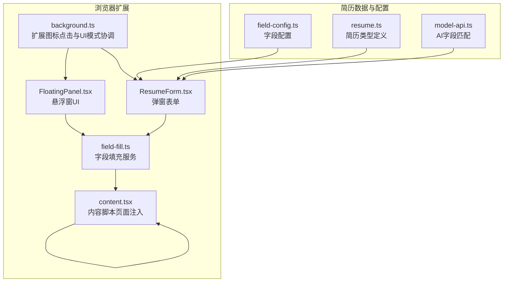
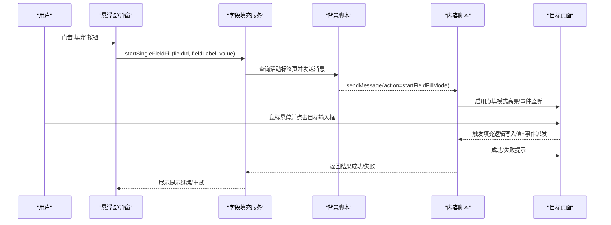
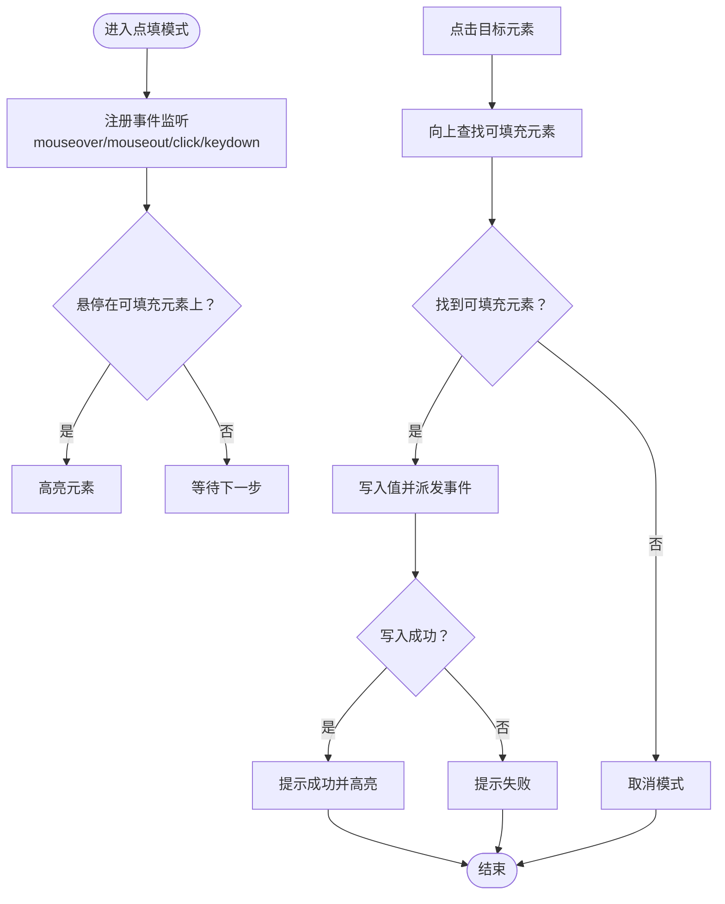
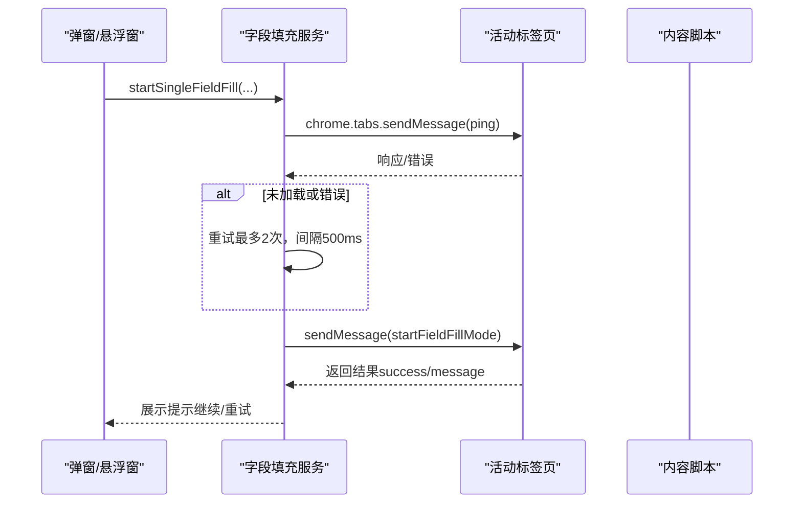
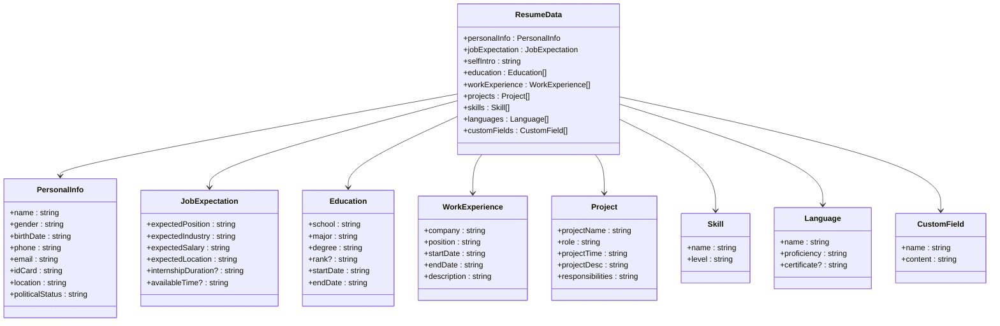
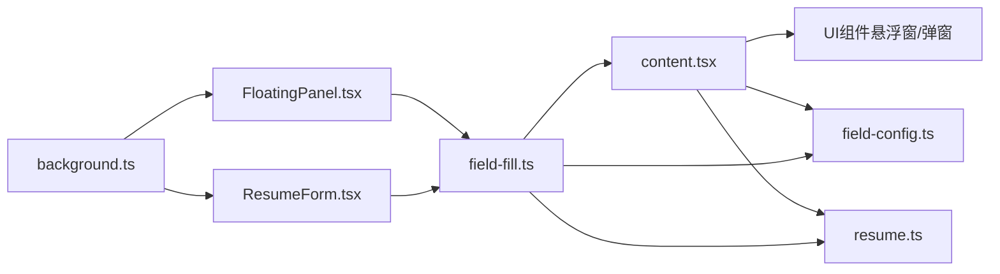

# 智能填充

<cite>
**本文引用的文件**
- [content.tsx](file://src/content.tsx)
- [field-fill.ts](file://src/services/field-fill.ts)
- [field-config.ts](file://src/config/field-config.ts)
- [resume.ts](file://src/types/resume.ts)
- [FloatingPanel.tsx](file://src/components/floating/FloatingPanel.tsx)
- [background.ts](file://src/background.ts)
- [README.zh-CN.md](file://assets/README.zh-CN.md)
- [model-api.ts](file://src/services/model-api.ts)
- [ResumeForm.tsx](file://src/features/popup/ResumeForm.tsx)
- [field-fill-button.tsx](file://src/components/ui/field-fill-button.tsx)
- [input-with-fill.tsx](file://src/components/ui/input-with-fill.tsx)
</cite>

## 目录
1. [简介](#简介)
2. [项目结构](#项目结构)
3. [核心组件](#核心组件)
4. [架构总览](#架构总览)
5. [详细组件分析](#详细组件分析)
6. [依赖关系分析](#依赖关系分析)
7. [性能考量](#性能考量)
8. [故障排查指南](#故障排查指南)
9. [结论](#结论)
10. [附录](#附录)

## 简介
本文件聚焦“智能填充”功能的技术实现，围绕 content.tsx 内容脚本如何注入目标招聘网站页面，并通过 field-fill.ts 服务实现表单字段的自动识别与填充。文档解释字段映射机制、简历数据模型与网页表单的匹配策略，对比“一键预填”与“点填模式”的交互差异，说明基于 DOM 选择器的动态定位方法，并给出针对 BOSS 直聘、拉勾网等站点的适配建议。同时阐述错误处理与降级方案，以及如何扩展新网站的适配规则与自定义填充逻辑。

## 项目结构
本项目采用 Plasmo 框架，content.tsx 作为内容脚本在目标网页中运行，负责与页面交互；field-fill.ts 位于服务层，负责跨标签页通信与消息调度；UI 层由悬浮窗 FloatingPanel.tsx 和弹窗 ResumeForm.tsx 提供交互入口；字段配置与类型定义分别来自 field-config.ts 与 resume.ts；model-api.ts 提供 AI 辅助字段匹配能力；background.ts 协调 UI 模式（悬浮窗/弹窗）。

图表来源
- [background.ts](file://src/background.ts#L1-L80)
- [content.tsx](file://src/content.tsx#L1-L150)
- [field-fill.ts](file://src/services/field-fill.ts#L1-L120)
- [FloatingPanel.tsx](file://src/components/floating/FloatingPanel.tsx#L1-L120)
- [ResumeForm.tsx](file://src/features/popup/ResumeForm.tsx#L1-L120)
- [field-config.ts](file://src/config/field-config.ts#L1-L120)
- [resume.ts](file://src/types/resume.ts#L1-L120)
- [model-api.ts](file://src/services/model-api.ts#L289-L342)

章节来源
- [content.tsx](file://src/content.tsx#L1-L150)
- [field-fill.ts](file://src/services/field-fill.ts#L1-L120)
- [field-config.ts](file://src/config/field-config.ts#L1-L120)
- [resume.ts](file://src/types/resume.ts#L1-L120)
- [FloatingPanel.tsx](file://src/components/floating/FloatingPanel.tsx#L1-L120)
- [background.ts](file://src/background.ts#L1-L80)
- [model-api.ts](file://src/services/model-api.ts#L289-L342)

## 核心组件
- 内容脚本 content.tsx：负责在目标页面启用“点填模式”，通过鼠标悬停高亮、点击定位、键盘取消等交互完成字段注入；内置可填充元素判断与值写入逻辑。
- 字段填充服务 field-fill.ts：在弹窗/悬浮窗模式下，通过 chrome.tabs.sendMessage 与 content.tsx 通信，启动“点填模式”，并处理 ping、重试、错误提示等。
- 字段配置 field-config.ts：定义简历各模块字段（静态与动态项）及选项，为 UI 渲染与字段映射提供依据。
- 简历类型 resume.ts：定义简历数据结构与默认值，支撑字段映射与填充。
- 悬浮窗 FloatingPanel.tsx：提供拖拽、最小化、模板选择、简历上传与导出等功能，承载“一键预填”场景。
- 弹窗 ResumeForm.tsx：渲染简历表单，提供字段填充按钮，支持一键预填。
- AI 匹配 model-api.ts：提供基于大模型的字段匹配能力，提升跨站点字段识别准确率。
- 背景脚本 background.ts：协调 UI 模式切换，控制扩展图标点击行为。

章节来源
- [content.tsx](file://src/content.tsx#L150-L454)
- [field-fill.ts](file://src/services/field-fill.ts#L120-L260)
- [field-config.ts](file://src/config/field-config.ts#L1-L200)
- [resume.ts](file://src/types/resume.ts#L1-L120)
- [FloatingPanel.tsx](file://src/components/floating/FloatingPanel.tsx#L1-L200)
- [ResumeForm.tsx](file://src/features/popup/ResumeForm.tsx#L1-L200)
- [model-api.ts](file://src/services/model-api.ts#L289-L342)
- [background.ts](file://src/background.ts#L1-L80)

## 架构总览
智能填充的整体流程如下：
- 用户在悬浮窗或弹窗中选择字段，点击“填充”按钮；
- 字段填充服务通过消息通道通知 content.tsx 启动“点填模式”；
- content.tsx 在页面上启用高亮与事件监听，用户点击目标输入框后完成值注入；
- 若页面未加载 content.tsx，服务层会进行 ping 与重试，必要时提示刷新页面；
- 对于复杂表单，可结合 AI 匹配提升字段识别准确度。

图表来源
- [field-fill.ts](file://src/services/field-fill.ts#L120-L260)
- [content.tsx](file://src/content.tsx#L150-L320)
- [background.ts](file://src/background.ts#L1-L80)

## 详细组件分析

### 内容脚本 content.tsx：点填模式与 DOM 注入
- 模式切换与消息监听：监听来自悬浮窗的自定义事件与来自 popup 的 chrome.runtime 消息，支持切换悬浮窗显示状态、显示/隐藏悬浮窗、启动字段填充模式。
- 点填模式核心：
  - 启用模式：注册 mouseover/mouseout/click/keydown 事件，设置光标样式，显示提示。
  - 元素定位：向上最多遍历 5 层父节点，判定是否为可填充元素（input/textarea/select/contenteditable 等）。
  - 值注入：根据元素类型设置 value 或 textContent，并派发 input/change/blur 等事件；对受控组件通过原生 setter 触发 React 更新。
  - 结果反馈：成功/失败提示，短暂高亮已填充字段。
- 清理与取消：移除事件监听、恢复光标、隐藏提示；Esc 键取消。

图表来源
- [content.tsx](file://src/content.tsx#L197-L320)

章节来源
- [content.tsx](file://src/content.tsx#L150-L454)

### 字段填充服务 field-fill.ts：跨标签页通信与错误处理
- 环境检测：区分 content script 环境与 popup 环境，分别走直接事件或 chrome.tabs.sendMessage。
- 启动流程：检查字段值有效性，构造 payload，ping 页面确认 content script 就绪，发送启动消息。
- 错误与重试：对“端口关闭/接收方不存在/连接失败”等错误进行分类与重试，提供友好提示；若 popup 快速关闭导致响应丢失，按成功处理以避免阻塞用户。
- 结果反馈：返回“请在网页中点击要填入的位置”等提示，保持 popup 不自动关闭以便连续填充。

图表来源
- [field-fill.ts](file://src/services/field-fill.ts#L120-L260)

章节来源
- [field-fill.ts](file://src/services/field-fill.ts#L1-L260)

### 字段映射机制与简历数据模型
- 简历数据模型：定义了个人信息、求职期望、教育经历、工作/实习经历、项目经历、技能、语言能力、自定义字段等结构与默认值，支撑字段映射与填充。
- 字段配置：提供静态字段与动态项（含列表 ID、添加按钮 ID、字段列表、最小条目数）；动态项字段还提供字段名到标签的映射，便于 UI 与提示。
- AI 辅助匹配：通过构建页面字段与简历字段描述，调用大模型返回高置信度匹配结果，降低跨站点字段识别成本。

图表来源
- [resume.ts](file://src/types/resume.ts#L1-L120)
- [field-config.ts](file://src/config/field-config.ts#L1-L120)
- [model-api.ts](file://src/services/model-api.ts#L289-L342)

章节来源
- [resume.ts](file://src/types/resume.ts#L1-L212)
- [field-config.ts](file://src/config/field-config.ts#L1-L200)
- [model-api.ts](file://src/services/model-api.ts#L289-L342)

### “一键预填”与“点填模式”的实现差异
- 一键预填（悬浮窗/弹窗）：
  - 通过 UI 组件渲染字段，用户直接点击“填充”按钮，服务层将字段值注入页面对应输入框。
  - 适用于结构清晰、可直接定位的表单场景。
- 点填模式（content.tsx）：
  - 由服务层启动，页面启用高亮与事件监听，用户手动点击目标输入框完成注入。
  - 适用于复杂表单、动态表单或字段定位困难的场景。

章节来源
- [field-fill-button.tsx](file://src/components/ui/field-fill-button.tsx#L1-L47)
- [input-with-fill.tsx](file://src/components/ui/input-with-fill.tsx#L1-L50)
- [content.tsx](file://src/content.tsx#L197-L320)

### DOM 选择器与动态定位策略
- 可填充元素判定：支持 input/textarea/select，以及 contenteditable=true、role 为 textbox/combobox/searchbox 的元素。
- 点击定位：从点击元素向上最多遍历 5 层父节点，找到第一个可填充元素即为目标。
- 值注入策略：根据元素类型设置 value 或 textContent，并派发 input/change/blur 等事件；对受控组件通过原生 setter 触发 React 更新。

章节来源
- [content.tsx](file://src/content.tsx#L300-L380)

### 实际案例：BOSS 直聘与拉勾网适配策略
- 平台支持：项目文档明确支持 BOSS 直聘、拉勾网等主流招聘网站，采用通用表单识别技术，理论上支持所有招聘网站。
- 适配建议：
  - 若页面表单无法自动识别，优先使用“点填模式”手动指定目标输入框。
  - 对于复杂表单（如多步骤、动态增删项），结合 AI 字段匹配提升识别准确度。
  - 针对特定站点的特殊结构，可在 UI 层补充字段映射规则或自定义填充逻辑。

章节来源
- [README.zh-CN.md](file://assets/README.zh-CN.md#L273-L288)

### 错误处理与降级方案
- 页面未加载 content.tsx：服务层 ping 失败时提示刷新页面后重试。
- 连接异常：对“端口关闭/接收方不存在/连接失败”进行分类与重试（最多 2 次，间隔 500ms）。
- 字段值无效：在 UI 层阻止空值注入，并提示用户先填写相应字段。
- 注入失败：content.tsx 对注入过程进行 try/catch 并返回失败，提示用户重试。

章节来源
- [field-fill.ts](file://src/services/field-fill.ts#L120-L260)
- [field-fill-button.tsx](file://src/components/ui/field-fill-button.tsx#L1-L47)
- [content.tsx](file://src/content.tsx#L360-L380)

### 扩展新网站适配规则与自定义填充逻辑
- 字段映射扩展：
  - 在 UI 层增加字段映射规则，将简历字段与目标站点字段进行绑定。
  - 对动态项（教育、工作、项目、技能、语言）可利用现有动态配置结构，补充列表 ID、添加按钮 ID 与字段列表。
- 自定义填充逻辑：
  - 在 content.tsx 中扩展可填充元素判定与注入策略，以适配特殊组件（如富文本编辑器、第三方组件库）。
  - 对于复杂交互（如联动选择、异步加载），在 content.tsx 中增加事件监听与注入时机控制。
- AI 匹配集成：
  - 使用 model-api.ts 的 aiMatchFields 接口，将页面字段与简历字段描述传入模型，获得高置信度匹配结果，减少人工映射成本。

章节来源
- [field-config.ts](file://src/config/field-config.ts#L330-L400)
- [model-api.ts](file://src/services/model-api.ts#L289-L342)
- [content.tsx](file://src/content.tsx#L300-L380)

## 依赖关系分析
- content.tsx 依赖：
  - UI 组件（悬浮窗/弹窗）用于启动点填模式；
  - 字段配置与类型定义用于字段映射；
  - 背景脚本用于 UI 模式切换。
- field-fill.ts 依赖：
  - chrome.tabs API 与 runtime 消息通道；
  - 字段配置与类型定义；
  - content.tsx 的消息处理。
- UI 层（FloatingPanel.tsx、ResumeForm.tsx）依赖：
  - 字段配置与类型定义；
  - 字段填充按钮组件；
  - 模板与存储钩子。

图表来源
- [content.tsx](file://src/content.tsx#L1-L150)
- [field-fill.ts](file://src/services/field-fill.ts#L1-L120)
- [field-config.ts](file://src/config/field-config.ts#L1-L120)
- [resume.ts](file://src/types/resume.ts#L1-L120)
- [FloatingPanel.tsx](file://src/components/floating/FloatingPanel.tsx#L1-L120)
- [ResumeForm.tsx](file://src/features/popup/ResumeForm.tsx#L1-L120)
- [background.ts](file://src/background.ts#L1-L80)

章节来源
- [content.tsx](file://src/content.tsx#L1-L150)
- [field-fill.ts](file://src/services/field-fill.ts#L1-L120)
- [field-config.ts](file://src/config/field-config.ts#L1-L120)
- [resume.ts](file://src/types/resume.ts#L1-L120)
- [FloatingPanel.tsx](file://src/components/floating/FloatingPanel.tsx#L1-L120)
- [ResumeForm.tsx](file://src/features/popup/ResumeForm.tsx#L1-L120)
- [background.ts](file://src/background.ts#L1-L80)

## 性能考量
- 事件监听与清理：点填模式启用时注册大量事件监听，退出时必须完整移除，避免内存泄漏与性能损耗。
- 重试策略：消息发送失败时进行有限次数重试，避免频繁重试造成卡顿。
- DOM 操作：注入值后派发事件，尽量减少不必要的重排与重绘；对受控组件使用原生 setter，避免深层 React 更新开销。
- AI 匹配：模型调用应限制频率与批量大小，避免阻塞 UI。

[本节为通用指导，无需列出具体文件来源]

## 故障排查指南
- 页面未加载 content.tsx：
  - 现象：服务层 ping 失败，提示刷新页面。
  - 处理：刷新当前页面后重试。
- 连接异常：
  - 现象：出现“端口关闭/接收方不存在/连接失败”等错误。
  - 处理：等待 500ms 后自动重试；若仍失败，提示刷新页面。
- 字段值为空：
  - 现象：UI 层阻止注入并提示先填写字段。
  - 处理：在弹窗/悬浮窗中填写对应字段后再尝试。
- 注入失败：
  - 现象：点填模式提示失败。
  - 处理：重新点击目标输入框；若仍失败，改用手动选择或检查页面结构。

章节来源
- [field-fill.ts](file://src/services/field-fill.ts#L120-L260)
- [field-fill-button.tsx](file://src/components/ui/field-fill-button.tsx#L1-L47)
- [content.tsx](file://src/content.tsx#L360-L380)

## 结论
本项目通过 content.tsx 与 field-fill.ts 的协同，实现了“点填模式”的灵活注入与“一键预填”的便捷体验。借助字段配置与简历类型定义，系统能够将简历数据模型中的字段精准映射到网页表单；通过 AI 匹配与 DOM 动态定位，进一步提升了跨站点适配能力。对于 BOSS 直聘、拉勾网等站点，建议优先使用“点填模式”或结合 AI 匹配；当遇到复杂表单时，可通过扩展 content.tsx 的注入策略与 UI 层的映射规则实现定制化适配。

[本节为总结性内容，无需列出具体文件来源]

## 附录
- 支持站点参考：项目文档明确支持 BOSS 直聘、拉勾网等主流招聘网站，且采用通用表单识别技术，理论上支持所有招聘网站。
- 一键预填入口：悬浮窗/弹窗中的字段填充按钮可直接将值注入页面对应输入框。
- 点填模式入口：通过服务层消息启动，页面启用高亮与事件监听，用户手动点击目标输入框完成注入。

章节来源
- [README.zh-CN.md](file://assets/README.zh-CN.md#L273-L288)
- [field-fill-button.tsx](file://src/components/ui/field-fill-button.tsx#L1-L47)
- [content.tsx](file://src/content.tsx#L197-L320)