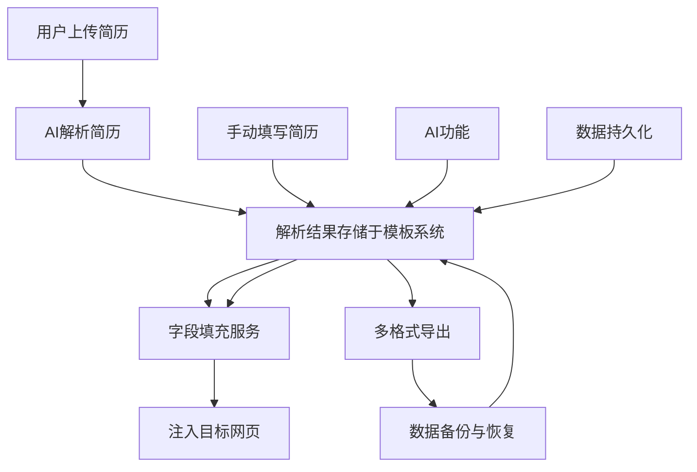

# 核心功能

<cite>
**本文档引用的文件**   
- [README.md](file://README.md)
- [popup.tsx](file://src/popup.tsx)
- [resume-parse.ts](file://src/services/resume-parse.ts)
- [field-fill.ts](file://src/services/field-fill.ts)
- [model-api.ts](file://src/services/model-api.ts)
- [export.ts](file://src/utils/export.ts)
- [useResumeTemplates.ts](file://src/hooks/useResumeTemplates.ts)
- [useStorage.ts](file://src/hooks/useStorage.ts)
</cite>

## 目录
1. [简介](#简介)
2. [简历管理](#简历管理)
3. [智能填充](#智能填充)
4. [AI功能](#ai功能)
5. [数据持久化](#数据持久化)
6. [多格式导出](#多格式导出)
7. [功能协同关系](#功能协同关系)
8. [用户工作流一致性](#用户工作流一致性)

## 简介
本插件是一款强大的简历自动填写助手，支持智能简历解析和手动填写两种模式，具备AI智能字段匹配和字段级精确填充能力，帮助求职者快速准确地完成各大招聘网站的简历填写。核心功能涵盖简历管理、智能填充、AI功能、数据持久化和多格式导出五大领域，形成从简历创建到最终投递的完整闭环。

## 简历管理

插件提供完整的简历信息管理功能，支持多个简历模板的创建、切换、重命名、复制和删除。用户可以管理以下简历模块：

- **基本信息**：姓名、性别、出生日期、手机号码、电子邮箱、身份证号、所在地、政治面貌
- **求职期望**：期望职位、期望行业、期望薪资、期望地点
- **教育经历**：学校名称、专业、学历、排名、入学/毕业时间（支持多条记录）
- **工作/实习经历**：公司名称、职位、开始/结束时间、工作描述（支持多条记录）
- **项目经历**：项目名称、担任角色、项目时间、项目描述、职责描述（支持多条记录）
- **技能**：技能名称、技能水平（初级/中级/高级/专家）（支持多条记录）
- **语言能力**：语言名称、掌握程度（入门/基础/熟练/精通）、证书（支持多条记录）
- **自定义字段**：字段名称、字段内容（支持多条记录）
- **自我描述**：个人优势和特点

用户可以通过模板系统管理多个简历，实现不同职位的简历定制化。

**Section sources**
- [README.md](file://README.md#L31-L46)
- [popup.tsx](file://src/popup.tsx#L131-L142)
- [useResumeTemplates.ts](file://src/hooks/useResumeTemplates.ts#L17-L234)

## 智能填充

智能填充功能包括一键预填和字段级精确填充两种模式：

### 一键预填功能
- 点击"📋 预填"按钮，自动将简历数据填充到当前招聘网站表单
- 智能识别表单字段并自动匹配相应简历信息
- 支持input、textarea、select、contenteditable等多种表单元素
- 自动触发表单事件（input、change、blur），确保网站验证通过
- 填充后提供视觉反馈，高亮已填充字段

### 字段级精确填充（↗ 点填）
- 每个字段都有"↗"按钮用于**单字段精确填充**
- 点击按钮进入"点填模式"：
  - 页面顶部显示操作提示
  - 可填充元素在鼠标悬停时显示蓝色边框
  - 点击目标输入框即可填充字段值
  - 按`Esc`键取消操作
- 支持填充到：input、textarea、select、contenteditable元素
- 自动触发表单事件（input、change、blur），确保网站验证通过
- 成功填充后自动关闭弹窗，便于连续操作

**Section sources**
- [README.md](file://README.md#L47-L68)
- [content.tsx](file://src/content.tsx#L157-L287)
- [field-fill.ts](file://src/services/field-fill.ts#L6-L260)

## AI功能

插件集成了多个国内大模型服务提供商，支持智能简历内容优化和字段匹配：

### 支持的大模型服务提供商
- **DeepSeek**：DeepSeek Chat, DeepSeek Coder
- **Kimi (Moonshot)**：Moonshot 8K/32K/128K
- **通义千问 (阿里云)**：Qwen Turbo/Plus/Max/Max Long Text
- **火山引擎 (Doubao)**：Doubao Seed 1.6, Doubao Seed 1.6 Lite, Doubao Seed 1.6 Flash
- **智谱AI**：GLM-4, GLM-4 Flash, GLM-3 Turbo
- **百川智能**：Baichuan 2 Turbo, Baichuan 2 Turbo 192K
- **自定义**：支持任何兼容OpenAI的API

### AI功能特性
- 一键API连接测试
- **✨ AI一键简历优化**：智能优化自我介绍、工作描述、项目描述等
- **🤖 AI生成简历介绍**：基于简历数据智能生成专业自我介绍（200-300字）
  - 支持复制到剪贴板、填充到自我描述字段、下载为TXT文件
- 使用STAR法则优化工作和项目描述
- 自动添加量化数据和成果描述

**Section sources**
- [README.md](file://README.md#L69-L91)
- [model-api.ts](file://src/services/model-api.ts#L6-L678)
- [config/model-providers.ts](file://src/config/model-providers.ts)

## 数据持久化

插件采用浏览器原生存储方案，确保数据安全可靠：

- **Chrome Storage API**：使用浏览器原生存储进行安全可靠的数据存储
- **实时自动保存**：表单内容变更时自动保存，防止数据丢失
- **手动保存**：支持点击保存按钮手动确认保存
- **数据重置**：一键清除所有简历数据，重新开始
- **自动设置保存**：设置页面配置自动保存，无需手动确认

所有数据仅存储在本地浏览器中，不会上传到任何服务器，确保用户数据隐私安全。

**Section sources**
- [README.md](file://README.md#L114-L120)
- [useStorage.ts](file://src/hooks/useStorage.ts#L7-L102)
- [popup.tsx](file://src/popup.tsx#L159-L162)

## 多格式导出

插件支持多种格式的简历导出，满足不同场景需求：

- **JSON导出**：导出完整简历数据，用于备份和跨设备同步
- **LaTeX导出**：生成专业LaTeX简历模板
  - 可直接在[Overleaf](https://www.overleaf.com/)上编译
  - 支持中文（使用ctex包）
  - 专业排版，适合学术和技术岗位申请
  - 包含完整的样式定义和注释
- **AI生成简历介绍**：调用AI智能生成专业自我介绍
  - 生成后可复制、填充到自我描述字段或下载为TXT文件
- **简历介绍提示词**：导出与AI交互的结构化提示词（支持`.md`/`.txt`），文件名自动命名为"用户名_简历提示词_日期"

**Section sources**
- [README.md](file://README.md#L92-L99)
- [export.ts](file://src/utils/export.ts#L1-L595)
- [ExportDialog.tsx](file://src/features/popup/ExportDialog.tsx#L1-L140)

## 功能协同关系

各核心功能之间存在紧密的协同关系，形成完整的用户工作流：

**Diagram sources**
- [resume-parse.ts](file://src/services/resume-parse.ts#L38-L109)
- [useResumeTemplates.ts](file://src/hooks/useResumeTemplates.ts#L17-L234)
- [field-fill.ts](file://src/services/field-fill.ts#L46-L260)
- [export.ts](file://src/utils/export.ts#L536-L574)

## 用户工作流一致性

插件设计遵循用户工作流一致性原则，从简历创建到最终投递形成完整闭环：

整个工作流确保用户能够高效、便捷地完成求职过程中的简历相关操作，提升求职效率。

**Diagram sources**
- [popup.tsx](file://src/popup.tsx#L124-L297)
- [README.md](file://README.md#L194-L273)
- [useResumeTemplates.ts](file://src/hooks/useResumeTemplates.ts#L17-L234)