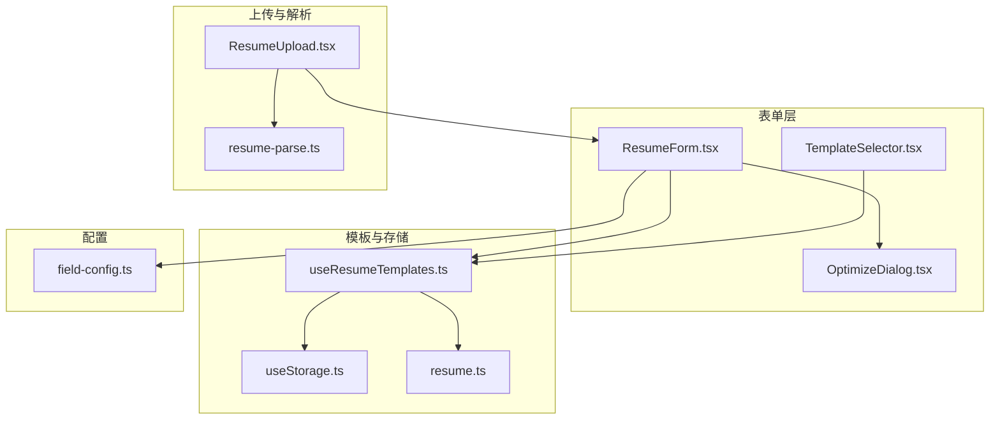
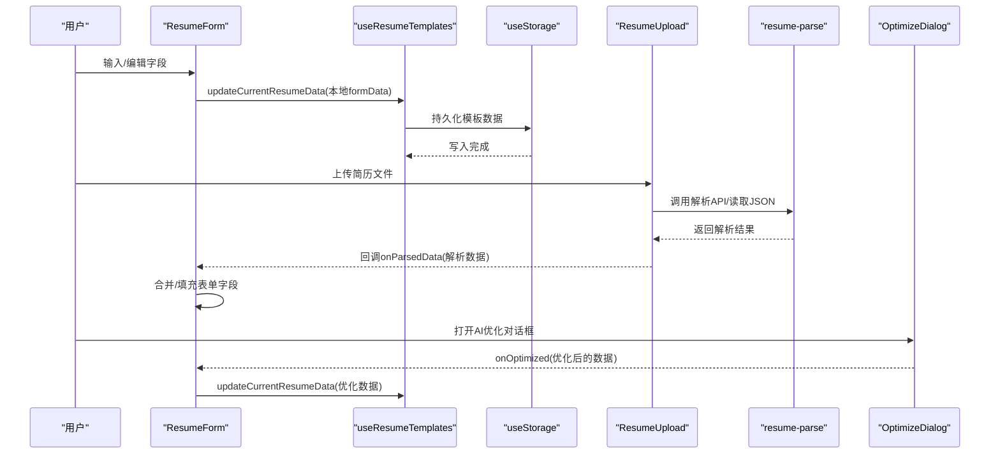
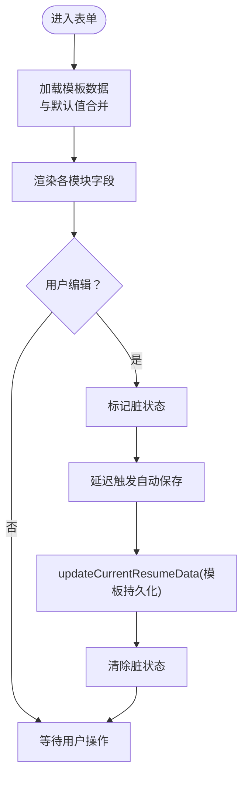
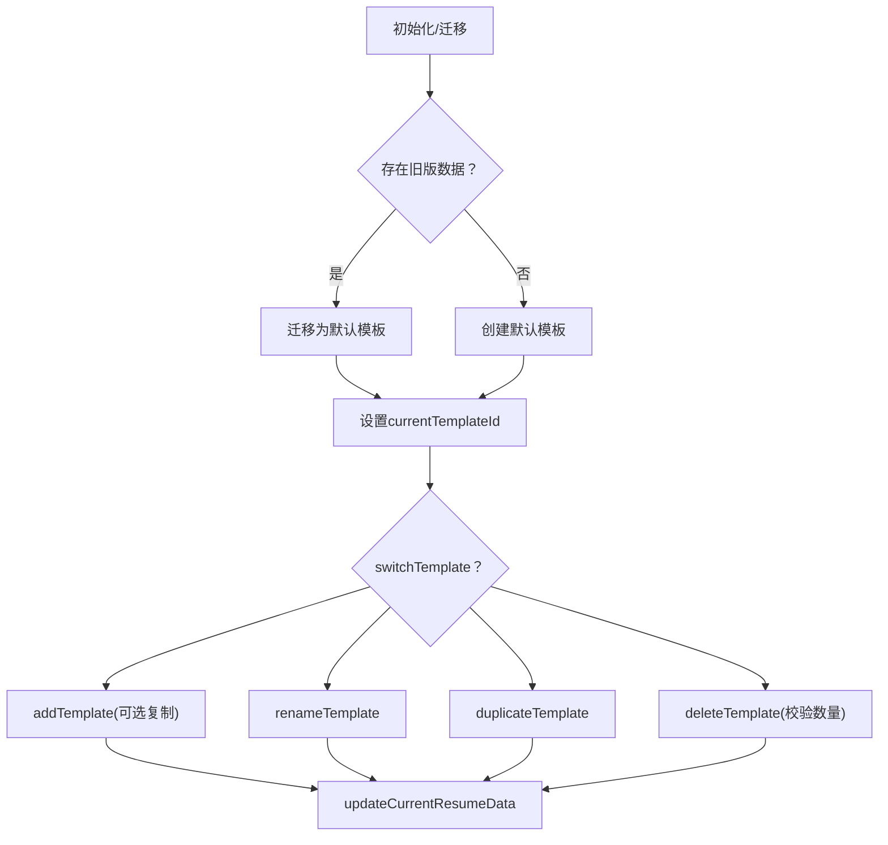
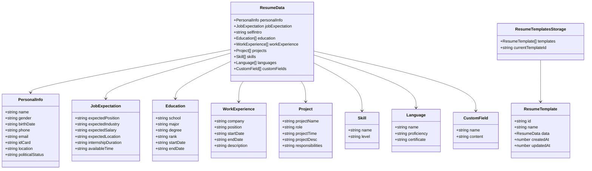
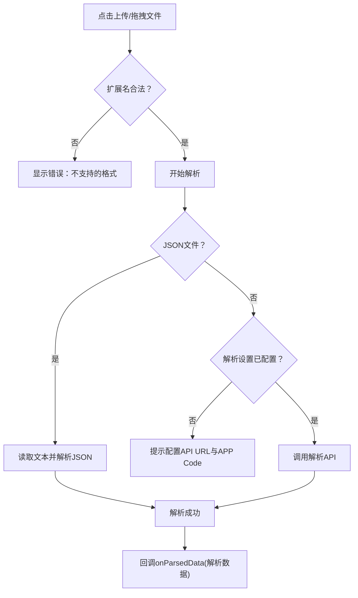
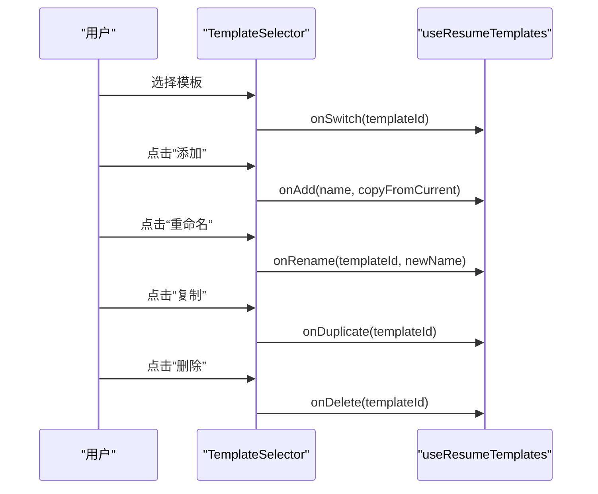
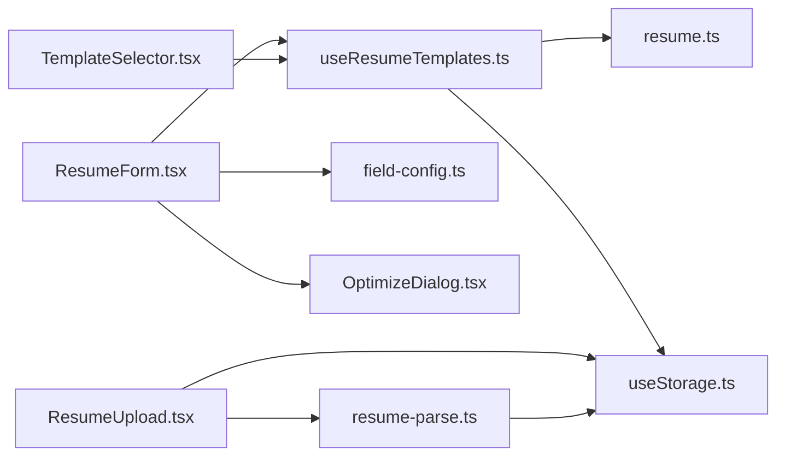

# 简历管理

<cite>
**本文引用的文件**
- [src/features/popup/ResumeForm.tsx](file://src/features/popup/ResumeForm.tsx)
- [src/hooks/useResumeTemplates.ts](file://src/hooks/useResumeTemplates.ts)
- [src/types/resume.ts](file://src/types/resume.ts)
- [src/features/popup/ResumeUpload.tsx](file://src/features/popup/ResumeUpload.tsx)
- [src/services/resume-parse.ts](file://src/services/resume-parse.ts)
- [src/components/common/TemplateSelector.tsx](file://src/components/common/TemplateSelector.tsx)
- [src/config/field-config.ts](file://src/config/field-config.ts)
- [src/hooks/useStorage.ts](file://src/hooks/useStorage.ts)
- [src/features/popup/OptimizeDialog.tsx](file://src/features/popup/OptimizeDialog.tsx)
</cite>

## 目录
1. [简介](#简介)
2. [项目结构](#项目结构)
3. [核心组件](#核心组件)
4. [架构总览](#架构总览)
5. [详细组件分析](#详细组件分析)
6. [依赖关系分析](#依赖关系分析)
7. [性能考虑](#性能考虑)
8. [故障排查指南](#故障排查指南)
9. [结论](#结论)
10. [附录](#附录)

## 简介
本章节面向希望在插件中实现“简历管理”能力的开发者，围绕以下目标展开：
- 通过 ResumeForm.tsx 组件管理简历表单，覆盖基本信息、求职期望、自我介绍、教育经历、工作/实习经历、项目经历、技能、语言能力、自定义字段等模块。
- 通过 useResumeTemplates.ts 自定义 Hook 协同实现多模板的创建、切换、重命名、复制、删除与持久化存储。
- 解释 ResumeData 数据结构设计与字段组织方式。
- 展示表单状态管理与数据同步机制（本地状态与模板存储联动）。
- 说明用户上传简历文件后，ResumeUpload.tsx 如何触发解析流程并将结果注入表单。
- 提供多模板管理的使用场景与交互逻辑，并指导如何扩展新的简历字段或自定义模块。

## 项目结构
简历管理相关的核心文件分布如下：
- 表单与模板：ResumeForm.tsx、TemplateSelector.tsx、useResumeTemplates.ts
- 数据模型：resume.ts
- 上传与解析：ResumeUpload.tsx、resume-parse.ts
- 字段配置：field-config.ts
- 存储抽象：useStorage.ts
- AI优化：OptimizeDialog.tsx

图表来源
- [src/features/popup/ResumeForm.tsx](file://src/features/popup/ResumeForm.tsx#L1-L782)
- [src/components/common/TemplateSelector.tsx](file://src/components/common/TemplateSelector.tsx#L1-L259)
- [src/features/popup/OptimizeDialog.tsx](file://src/features/popup/OptimizeDialog.tsx#L1-L297)
- [src/hooks/useResumeTemplates.ts](file://src/hooks/useResumeTemplates.ts#L1-L258)
- [src/hooks/useStorage.ts](file://src/hooks/useStorage.ts#L1-L102)
- [src/types/resume.ts](file://src/types/resume.ts#L1-L212)
- [src/features/popup/ResumeUpload.tsx](file://src/features/popup/ResumeUpload.tsx#L1-L260)
- [src/services/resume-parse.ts](file://src/services/resume-parse.ts#L1-L342)
- [src/config/field-config.ts](file://src/config/field-config.ts#L1-L400)

章节来源
- [src/features/popup/ResumeForm.tsx](file://src/features/popup/ResumeForm.tsx#L1-L782)
- [src/hooks/useResumeTemplates.ts](file://src/hooks/useResumeTemplates.ts#L1-L258)
- [src/types/resume.ts](file://src/types/resume.ts#L1-L212)
- [src/features/popup/ResumeUpload.tsx](file://src/features/popup/ResumeUpload.tsx#L1-L260)
- [src/services/resume-parse.ts](file://src/services/resume-parse.ts#L1-L342)
- [src/components/common/TemplateSelector.tsx](file://src/components/common/TemplateSelector.tsx#L1-L259)
- [src/config/field-config.ts](file://src/config/field-config.ts#L1-L400)
- [src/hooks/useStorage.ts](file://src/hooks/useStorage.ts#L1-L102)
- [src/features/popup/OptimizeDialog.tsx](file://src/features/popup/OptimizeDialog.tsx#L1-L297)

## 核心组件
- ResumeForm.tsx：负责渲染完整的简历表单，管理本地表单状态，与模板系统联动实现持久化；提供“AI一键优化”入口。
- useResumeTemplates.ts：封装模板生命周期（创建、切换、重命名、复制、删除）、数据迁移与自动保存。
- resume.ts：定义 ResumeData、ResumeTemplate、默认值与工具函数，是模板存储的数据契约。
- ResumeUpload.tsx：提供简历文件上传与解析流程，支持拖拽、进度反馈与错误提示，并将解析结果回调给表单。
- resume-parse.ts：封装文件转Base64、调用外部API解析、统一输出结构化数据。
- TemplateSelector.tsx：提供模板选择与管理的UI交互（切换、添加、重命名、复制、删除）。
- field-config.ts：集中定义各字段的标签、类型、占位符、选项等配置，驱动表单渲染。
- useStorage.ts：跨浏览器环境的本地存储Hook，提供读取、写入、监听变更的能力。
- OptimizeDialog.tsx：封装AI优化对话框，收集待优化内容并调用优化服务。

章节来源
- [src/features/popup/ResumeForm.tsx](file://src/features/popup/ResumeForm.tsx#L1-L782)
- [src/hooks/useResumeTemplates.ts](file://src/hooks/useResumeTemplates.ts#L1-L258)
- [src/types/resume.ts](file://src/types/resume.ts#L1-L212)
- [src/features/popup/ResumeUpload.tsx](file://src/features/popup/ResumeUpload.tsx#L1-L260)
- [src/services/resume-parse.ts](file://src/services/resume-parse.ts#L1-L342)
- [src/components/common/TemplateSelector.tsx](file://src/components/common/TemplateSelector.tsx#L1-L259)
- [src/config/field-config.ts](file://src/config/field-config.ts#L1-L400)
- [src/hooks/useStorage.ts](file://src/hooks/useStorage.ts#L1-L102)
- [src/features/popup/OptimizeDialog.tsx](file://src/features/popup/OptimizeDialog.tsx#L1-L297)

## 架构总览
简历管理采用“表单组件 + 模板Hook + 存储Hook”的分层架构：
- 表单层：ResumeForm 负责渲染与交互，使用字段配置驱动各模块渲染。
- 模板层：useResumeTemplates 负责模板CRUD、迁移与自动保存，保证数据持久化与一致性。
- 存储层：useStorage 提供跨环境的本地存储抽象，兼容Chrome扩展与开发环境。
- 解析层：ResumeUpload 触发解析流程，resume-parse 统一处理API调用与数据映射。
- UI交互层：TemplateSelector 提供模板管理的可视化操作；OptimizeDialog 提供AI优化入口。

图表来源
- [src/features/popup/ResumeForm.tsx](file://src/features/popup/ResumeForm.tsx#L1-L782)
- [src/hooks/useResumeTemplates.ts](file://src/hooks/useResumeTemplates.ts#L1-L258)
- [src/hooks/useStorage.ts](file://src/hooks/useStorage.ts#L1-L102)
- [src/features/popup/ResumeUpload.tsx](file://src/features/popup/ResumeUpload.tsx#L1-L260)
- [src/services/resume-parse.ts](file://src/services/resume-parse.ts#L1-L342)
- [src/features/popup/OptimizeDialog.tsx](file://src/features/popup/OptimizeDialog.tsx#L1-L297)

## 详细组件分析

### ResumeForm.tsx：表单状态管理与数据同步
- 加载与合并：从模板系统加载当前模板数据，与默认值进行深度合并，确保字段完整性；切换模板时重置脏标记。
- 自动保存：本地表单状态变更后，延迟触发模板更新，避免频繁写入；写入完成后清除脏标记。
- 通用动态列表处理器：通过高阶函数 createListHandlers 生成教育、工作、项目、技能、语言、自定义字段的增删改操作。
- 渲染策略：静态字段使用 renderStaticField 统一渲染（含日期选择器、下拉选择、文本域等），动态列表项使用 DynamicListItem 统一渲染。
- 与模板系统协作：useResumeTemplates 提供 currentResumeData、updateCurrentResumeData、currentTemplateId 等，ResumeForm 在挂载与变更时双向同步。

图表来源
- [src/features/popup/ResumeForm.tsx](file://src/features/popup/ResumeForm.tsx#L248-L283)
- [src/features/popup/ResumeForm.tsx](file://src/features/popup/ResumeForm.tsx#L285-L402)
- [src/features/popup/ResumeForm.tsx](file://src/features/popup/ResumeForm.tsx#L508-L780)
- [src/hooks/useResumeTemplates.ts](file://src/hooks/useResumeTemplates.ts#L170-L192)

章节来源
- [src/features/popup/ResumeForm.tsx](file://src/features/popup/ResumeForm.tsx#L248-L283)
- [src/features/popup/ResumeForm.tsx](file://src/features/popup/ResumeForm.tsx#L285-L402)
- [src/features/popup/ResumeForm.tsx](file://src/features/popup/ResumeForm.tsx#L508-L780)
- [src/hooks/useResumeTemplates.ts](file://src/hooks/useResumeTemplates.ts#L170-L192)

### useResumeTemplates.ts：模板的创建、切换、重命名、复制与删除
- 初始化与迁移：若模板列表为空且存在旧版简历数据，则迁移至默认模板；否则创建默认模板并设为当前。
- 切换模板：根据传入的模板ID更新 currentTemplateId。
- 新增模板：支持从当前模板复制或从默认值创建新模板，并自动设为当前。
- 重命名模板：更新指定模板的名称与更新时间。
- 删除模板：限制至少保留一个模板；删除后自动选择新的当前模板。
- 复制模板：基于目标模板深拷贝创建副本并设为当前。
- 更新当前模板数据：支持函数式更新，自动更新updatedAt。

图表来源
- [src/hooks/useResumeTemplates.ts](file://src/hooks/useResumeTemplates.ts#L35-L80)
- [src/hooks/useResumeTemplates.ts](file://src/hooks/useResumeTemplates.ts#L94-L168)
- [src/hooks/useResumeTemplates.ts](file://src/hooks/useResumeTemplates.ts#L170-L216)

章节来源
- [src/hooks/useResumeTemplates.ts](file://src/hooks/useResumeTemplates.ts#L35-L80)
- [src/hooks/useResumeTemplates.ts](file://src/hooks/useResumeTemplates.ts#L94-L168)
- [src/hooks/useResumeTemplates.ts](file://src/hooks/useResumeTemplates.ts#L170-L216)

### ResumeData 数据结构与字段组织
- 个人信息：姓名、性别、出生日期、电话、邮箱、身份证、所在地、政治面貌。
- 求职期望：期望职位、期望行业、期望薪资、期望地点、实习时长、可入职时间。
- 自我介绍：字符串。
- 教育经历：数组，包含学校、专业、学历、排名、起止时间。
- 工作/实习经历：数组，包含公司、职位、起止时间、描述。
- 项目经历：数组，包含项目名、角色、项目时间、项目描述、职责。
- 技能：数组，包含技能名与水平。
- 语言能力：数组，包含语言名、掌握程度、证书。
- 自定义字段：数组，包含自定义字段名与内容。
- 默认值：defaultResumeData 提供全字段默认空值或空数组，确保字段完整性。
- 模板：ResumeTemplate 包含 id、name、data、createdAt、updatedAt；模板存储结构为 ResumeTemplatesStorage。

图表来源
- [src/types/resume.ts](file://src/types/resume.ts#L1-L212)

章节来源
- [src/types/resume.ts](file://src/types/resume.ts#L1-L212)

### ResumeUpload.tsx：上传与解析流程
- 支持格式：JSON、PDF、DOC、DOCX、TXT、HTML。
- 上传方式：拖拽、点击选择、回车清空input以支持重复选择。
- 解析策略：
  - JSON：直接读取文本并解析为对象。
  - 其他格式：校验解析设置（URL与APP Code），模拟进度，调用 parseResumeByAPI。
- 错误处理：对不支持格式、设置缺失、API错误进行分类提示。
- 结果注入：解析成功后回调 onParsedData，由 ResumeForm 接收并合并到表单。

图表来源
- [src/features/popup/ResumeUpload.tsx](file://src/features/popup/ResumeUpload.tsx#L1-L260)
- [src/services/resume-parse.ts](file://src/services/resume-parse.ts#L1-L110)
- [src/services/resume-parse.ts](file://src/services/resume-parse.ts#L111-L342)

章节来源
- [src/features/popup/ResumeUpload.tsx](file://src/features/popup/ResumeUpload.tsx#L1-L260)
- [src/services/resume-parse.ts](file://src/services/resume-parse.ts#L1-L110)
- [src/services/resume-parse.ts](file://src/services/resume-parse.ts#L111-L342)

### TemplateSelector.tsx：多模板管理的交互逻辑
- 选择：Select 控件绑定 currentTemplateId，切换模板。
- 添加：弹窗输入模板名，可选择“复制当前模板内容”，调用 onAdd。
- 重命名：弹窗输入新名称，调用 onRename。
- 复制：调用 onDuplicate，生成副本并设为当前。
- 删除：弹窗确认，调用 onDelete，若为最后一个模板则阻止删除。

图表来源
- [src/components/common/TemplateSelector.tsx](file://src/components/common/TemplateSelector.tsx#L1-L259)
- [src/hooks/useResumeTemplates.ts](file://src/hooks/useResumeTemplates.ts#L94-L168)
- [src/hooks/useResumeTemplates.ts](file://src/hooks/useResumeTemplates.ts#L170-L216)

章节来源
- [src/components/common/TemplateSelector.tsx](file://src/components/common/TemplateSelector.tsx#L1-L259)
- [src/hooks/useResumeTemplates.ts](file://src/hooks/useResumeTemplates.ts#L94-L168)
- [src/hooks/useResumeTemplates.ts](file://src/hooks/useResumeTemplates.ts#L170-L216)

### 字段配置与表单渲染
- 字段配置：field-config.ts 定义静态字段与动态列表字段的标签、类型、占位符、选项等。
- 渲染策略：ResumeForm 使用字段配置驱动 renderStaticField 与 DynamicListItem，统一处理输入控件与填充按钮。
- 动态列表：教育、工作、项目、技能、语言、自定义字段均通过 createListHandlers 生成统一的增删改操作。

章节来源
- [src/config/field-config.ts](file://src/config/field-config.ts#L1-L400)
- [src/features/popup/ResumeForm.tsx](file://src/features/popup/ResumeForm.tsx#L403-L780)

### AI优化集成
- OptimizeDialog：收集待优化内容清单（自我介绍、工作描述、项目描述、职责），校验API配置与内容是否存在，调用优化服务并回传优化后的数据。
- ResumeForm：接收 onOptimized 回调，更新本地表单并触发自动保存。

章节来源
- [src/features/popup/OptimizeDialog.tsx](file://src/features/popup/OptimizeDialog.tsx#L1-L297)
- [src/features/popup/ResumeForm.tsx](file://src/features/popup/ResumeForm.tsx#L315-L321)

## 依赖关系分析
- ResumeForm 依赖 useResumeTemplates、useStorage、field-config、OptimizeDialog。
- useResumeTemplates 依赖 useStorage、resume.ts 的默认值与模板工具。
- ResumeUpload 依赖 resume-parse 与 useStorage（解析设置）。
- TemplateSelector 依赖 useResumeTemplates 的操作方法。
- resume-parse 依赖 fileToBase64 与 fetch API。
- useStorage 依赖浏览器存储或本地降级。

图表来源
- [src/features/popup/ResumeForm.tsx](file://src/features/popup/ResumeForm.tsx#L1-L782)
- [src/hooks/useResumeTemplates.ts](file://src/hooks/useResumeTemplates.ts#L1-L258)
- [src/hooks/useStorage.ts](file://src/hooks/useStorage.ts#L1-L102)
- [src/types/resume.ts](file://src/types/resume.ts#L1-L212)
- [src/features/popup/ResumeUpload.tsx](file://src/features/popup/ResumeUpload.tsx#L1-L260)
- [src/services/resume-parse.ts](file://src/services/resume-parse.ts#L1-L342)
- [src/components/common/TemplateSelector.tsx](file://src/components/common/TemplateSelector.tsx#L1-L259)
- [src/config/field-config.ts](file://src/config/field-config.ts#L1-L400)
- [src/features/popup/OptimizeDialog.tsx](file://src/features/popup/OptimizeDialog.tsx#L1-L297)

章节来源
- [src/features/popup/ResumeForm.tsx](file://src/features/popup/ResumeForm.tsx#L1-L782)
- [src/hooks/useResumeTemplates.ts](file://src/hooks/useResumeTemplates.ts#L1-L258)
- [src/hooks/useStorage.ts](file://src/hooks/useStorage.ts#L1-L102)
- [src/types/resume.ts](file://src/types/resume.ts#L1-L212)
- [src/features/popup/ResumeUpload.tsx](file://src/features/popup/ResumeUpload.tsx#L1-L260)
- [src/services/resume-parse.ts](file://src/services/resume-parse.ts#L1-L342)
- [src/components/common/TemplateSelector.tsx](file://src/components/common/TemplateSelector.tsx#L1-L259)
- [src/config/field-config.ts](file://src/config/field-config.ts#L1-L400)
- [src/features/popup/OptimizeDialog.tsx](file://src/features/popup/OptimizeDialog.tsx#L1-L297)

## 性能考虑
- 自动保存去抖：表单变更后延迟保存，减少存储写入频率。
- 深度合并：加载模板数据时与默认值合并，避免字段缺失导致的渲染异常。
- 动态列表：统一的增删改处理器，避免重复逻辑与状态碎片。
- 解析进度：上传解析阶段提供进度条，改善用户体验。
- 存储监听：useStorage 监听存储变化，保证多实例间状态一致。

[本节为通用建议，无需列出具体文件来源]

## 故障排查指南
- 上传解析失败
  - 检查解析设置（URL与APP Code）是否配置。
  - 确认文件扩展名是否受支持。
  - 查看控制台错误信息，区分网络错误与认证错误。
- 模板无法删除
  - 最后一个模板不允许删除，需先新增或复制其他模板。
- 自动保存无效
  - 确认模板系统未处于加载状态；检查存储写入异常日志。
- 字段渲染异常
  - 确保字段配置与数据结构一致；检查默认值合并逻辑是否生效。

章节来源
- [src/features/popup/ResumeUpload.tsx](file://src/features/popup/ResumeUpload.tsx#L1-L260)
- [src/services/resume-parse.ts](file://src/services/resume-parse.ts#L1-L110)
- [src/hooks/useResumeTemplates.ts](file://src/hooks/useResumeTemplates.ts#L145-L168)
- [src/hooks/useStorage.ts](file://src/hooks/useStorage.ts#L1-L102)

## 结论
本方案通过“表单组件 + 模板Hook + 存储Hook”的分层设计，实现了简历数据的结构化管理与多模板持久化。ResumeForm 提供直观的表单体验，useResumeTemplates 负责模板生命周期与数据迁移，ResumeUpload 与 resume-parse 提供文件解析能力，TemplateSelector 提供模板管理交互。整体架构清晰、扩展性强，便于后续新增字段或模块。

[本节为总结性内容，无需列出具体文件来源]

## 附录

### 扩展新字段/模块的步骤指引
- 在 resume.ts 中新增接口与默认值
  - 定义新模块接口与默认值对象。
  - 在 ResumeData 中增加对应字段。
  - 若需要模板存储，确保 ResumeTemplate.data 能容纳该字段。
- 在 field-config.ts 中补充字段配置
  - 静态字段：在相应数组中添加 FieldConfig。
  - 动态列表：在 dynamicConfigs 中添加对应配置，并在 ResumeForm 中渲染。
- 在 ResumeForm.tsx 中接入
  - 使用 createListHandlers 生成增删改处理器（动态列表）。
  - 使用 renderStaticField 渲染静态字段。
  - 在自动保存与重置逻辑中纳入新字段。
- 在 TemplateSelector.tsx 中确认交互
  - 若需要在模板管理中显示新字段概览，可在 UI 中体现。
- 在解析流程中对接
  - 若需要从上传文件解析出新字段，完善 resume-parse.ts 的解析映射逻辑。

章节来源
- [src/types/resume.ts](file://src/types/resume.ts#L1-L212)
- [src/config/field-config.ts](file://src/config/field-config.ts#L1-L400)
- [src/features/popup/ResumeForm.tsx](file://src/features/popup/ResumeForm.tsx#L285-L402)
- [src/components/common/TemplateSelector.tsx](file://src/components/common/TemplateSelector.tsx#L1-L259)
- [src/services/resume-parse.ts](file://src/services/resume-parse.ts#L111-L342)