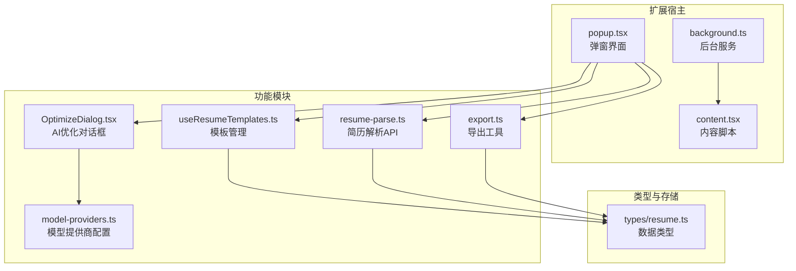
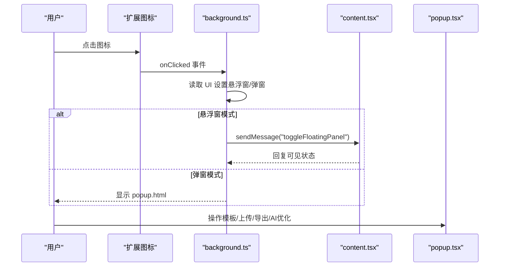
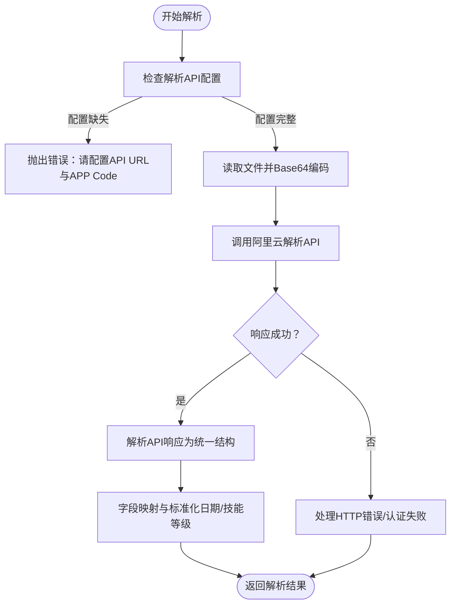
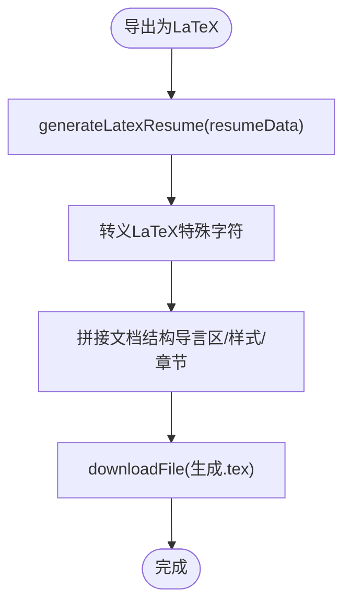
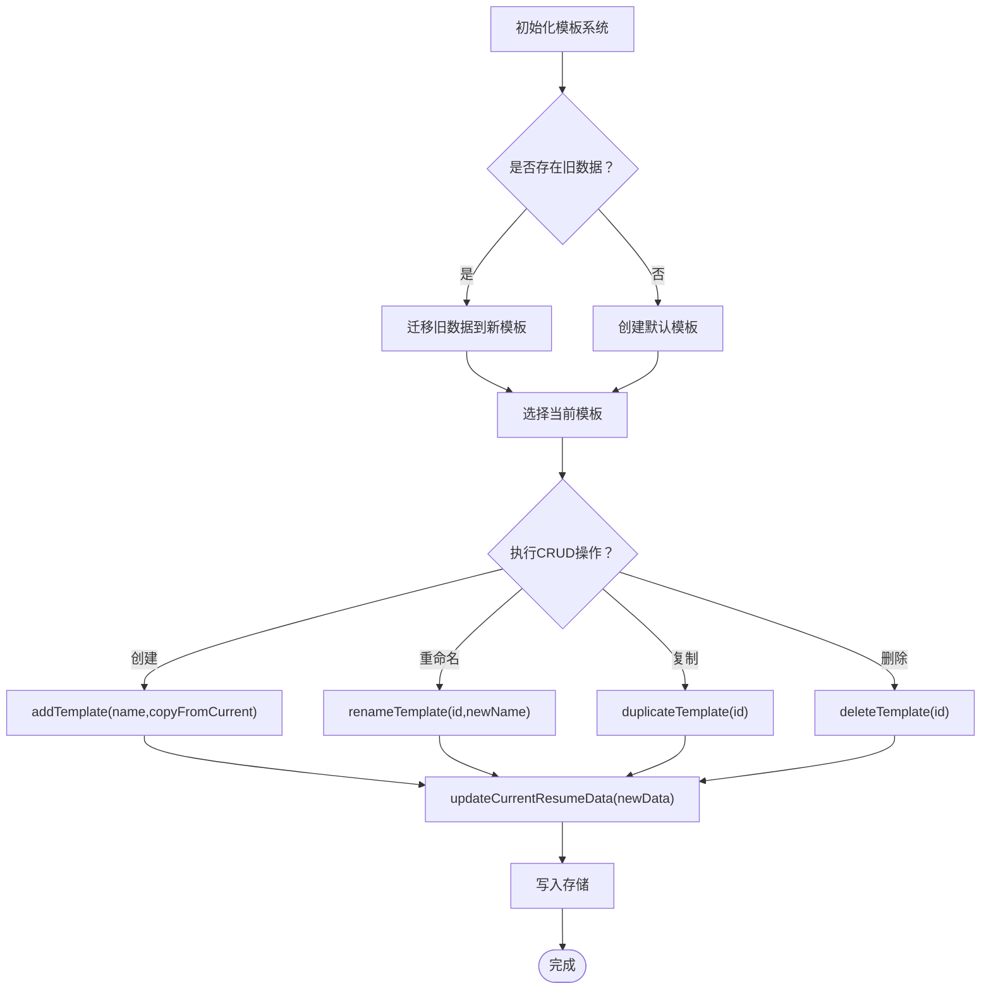
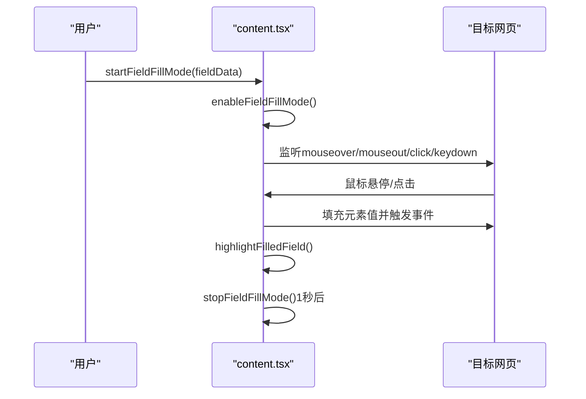
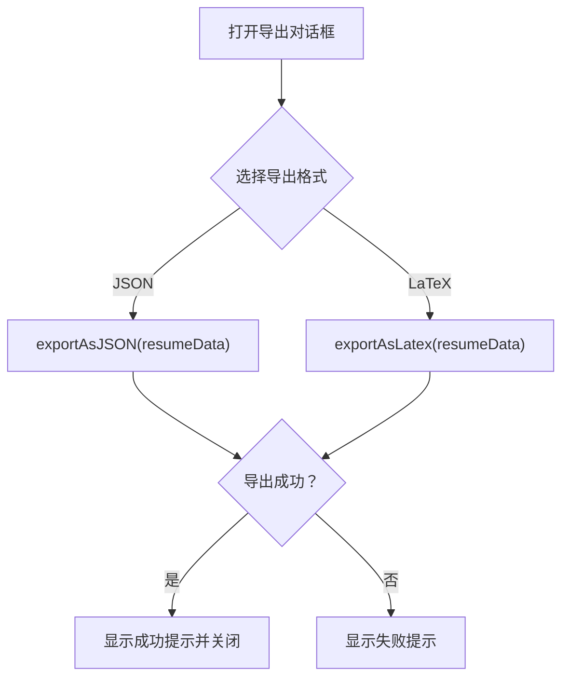
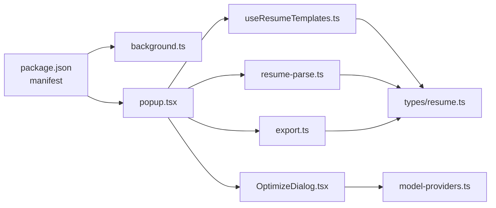

# 版本更新日志

<cite>
**本文引用的文件**
- [README.md](file://README.md)
- [package.json](file://package.json)
- [src/background.ts](file://src/background.ts)
- [src/content.tsx](file://src/content.tsx)
- [src/popup.tsx](file://src/popup.tsx)
- [src/features/popup/ExportDialog.tsx](file://src/features/popup/ExportDialog.tsx)
- [src/services/resume-parse.ts](file://src/services/resume-parse.ts)
- [src/utils/export.ts](file://src/utils/export.ts)
- [src/hooks/useResumeTemplates.ts](file://src/hooks/useResumeTemplates.ts)
- [src/types/resume.ts](file://src/types/resume.ts)
- [src/config/model-providers.ts](file://src/config/model-providers.ts)
- [src/features/popup/OptimizeDialog.tsx](file://src/features/popup/OptimizeDialog.tsx)
- [assets/README.zh-CN.md](file://assets/README.zh-CN.md)
</cite>

## 目录
1. [简介](#简介)
2. [项目结构](#项目结构)
3. [核心组件](#核心组件)
4. [架构总览](#架构总览)
5. [详细组件分析](#详细组件分析)
6. [依赖关系分析](#依赖关系分析)
7. [性能考量](#性能考量)
8. [故障排查指南](#故障排查指南)
9. [结论](#结论)
10. [附录](#附录)

## 简介
本文件为“Offer 捞捞”浏览器扩展的版本更新日志，面向 v1.0 初始发布版本，按时间倒序记录当前版本的功能集与演进路径。当前版本聚焦于以下核心能力：
- 多格式简历解析（PDF、DOCX、DOC、TXT、JSON）
- AI 内容优化与生成（多模型提供商集成）
- LaTeX 导出（支持中文与 Overleaf 编译）
- 多模板管理（模板创建、重命名、复制、删除与智能迁移）

未来版本将持续迭代，补充“一键预填”等新功能，并在 README 的“更新日志”章节中持续更新。

## 项目结构
项目采用 Chrome Extensions Manifest V3 架构，前端使用 React + Plasmo，核心模块围绕“弹窗界面（popup）—内容脚本（content）—后台服务（background）”三者协作展开，配合本地存储与导出工具链实现端到端的简历管理体验。



图表来源
- [src/background.ts](file://src/background.ts#L1-L80)
- [src/content.tsx](file://src/content.tsx#L1-L150)
- [src/popup.tsx](file://src/popup.tsx#L1-L120)
- [src/hooks/useResumeTemplates.ts](file://src/hooks/useResumeTemplates.ts#L1-L120)
- [src/services/resume-parse.ts](file://src/services/resume-parse.ts#L1-L120)
- [src/utils/export.ts](file://src/utils/export.ts#L530-L595)
- [src/features/popup/OptimizeDialog.tsx](file://src/features/popup/OptimizeDialog.tsx#L1-L120)
- [src/config/model-providers.ts](file://src/config/model-providers.ts#L1-L123)
- [src/types/resume.ts](file://src/types/resume.ts#L1-L120)

章节来源
- [README.md](file://README.md#L1-L120)
- [package.json](file://package.json#L1-L66)

## 核心组件
- 弹窗界面（popup）：提供“简历填写”“设置”两大标签页，内置模板选择器、上传解析、导出、AI 优化入口。
- 内容脚本（content）：注入页面，支持悬浮窗与“字段级精准填充”模式，监听扩展消息，控制 UI 展示与字段填充流程。
- 后台服务（background）：处理扩展图标点击事件，根据用户 UI 设置决定弹窗或悬浮窗行为，并与内容脚本通信。
- 模板管理（useResumeTemplates）：实现多模板 CRUD、数据迁移、当前模板数据读取与更新。
- 简历解析（resume-parse）：封装阿里云简历解析 API 调用，统一解析结果结构，支持日期标准化与技能等级映射。
- 导出工具（export）：提供 JSON 与 LaTeX 导出，LaTeX 支持中文与 Overleaf 编译。
- AI 优化（OptimizeDialog + model-providers）：整合多家大模型提供商，支持一键优化简历描述内容与生成自我介绍。

章节来源
- [src/popup.tsx](file://src/popup.tsx#L120-L300)
- [src/content.tsx](file://src/content.tsx#L56-L122)
- [src/background.ts](file://src/background.ts#L11-L76)
- [src/hooks/useResumeTemplates.ts](file://src/hooks/useResumeTemplates.ts#L1-L120)
- [src/services/resume-parse.ts](file://src/services/resume-parse.ts#L35-L120)
- [src/utils/export.ts](file://src/utils/export.ts#L530-L595)
- [src/features/popup/OptimizeDialog.tsx](file://src/features/popup/OptimizeDialog.tsx#L1-L120)
- [src/config/model-providers.ts](file://src/config/model-providers.ts#L1-L123)

## 架构总览
下面以序列图展示 v1.0 关键流程：扩展图标点击 -> 后台服务判断 UI 模式 -> 内容脚本切换悬浮窗或弹窗 -> 用户在弹窗中进行模板管理、上传解析、导出与 AI 优化。



图表来源
- [src/background.ts](file://src/background.ts#L11-L76)
- [src/content.tsx](file://src/content.tsx#L69-L122)
- [src/popup.tsx](file://src/popup.tsx#L120-L180)

## 详细组件分析

### 多格式简历解析（v1.0）
- 支持格式：PDF、DOCX、DOC、TXT、JSON
- 云端 API：集成阿里云简历解析 API，统一返回结构并进行字段映射
- JSON 导入：支持直接导入 JSON 数据，便于备份与恢复
- 智能字段映射：解析结果自动填充到对应表单字段



图表来源
- [src/services/resume-parse.ts](file://src/services/resume-parse.ts#L35-L120)
- [src/services/resume-parse.ts](file://src/services/resume-parse.ts#L137-L295)
- [src/services/resume-parse.ts](file://src/services/resume-parse.ts#L297-L342)

章节来源
- [README.md](file://README.md#L21-L30)
- [assets/README.zh-CN.md](file://assets/README.zh-CN.md#L21-L30)
- [src/services/resume-parse.ts](file://src/services/resume-parse.ts#L35-L120)

### AI 内容优化与生成（v1.0）
- 多模型提供商：DeepSeek、Kimi、通义千问、火山引擎、智谱 AI、百川智能、自定义 OpenAI 兼容
- 一键优化：对自我介绍、工作描述、项目描述等进行智能优化
- 生成自我介绍：基于简历数据生成 200-300 字的专业自我介绍，支持复制、填入、下载 TXT
- STAR 法则优化：提升描述的量化与成果表达

```mermaid
sequenceDiagram
participant User as "用户"
participant POP as "popup.tsx"
participant Opt as "OptimizeDialog.tsx"
participant API as "model-providers.ts"
participant Svc as "model-api未在本仓库出现，见README"
User->>POP : 点击“AI 一键优化”
POP->>Opt : 打开优化对话框
Opt->>Opt : 检查API配置与可优化内容
Opt->>API : 选择提供商与模型
Opt->>Svc : 调用优化接口逐项处理
Svc-->>Opt : 返回优化进度与结果
Opt-->>POP : 更新表单数据
POP-->>User : 显示优化完成
```

图表来源
- [src/features/popup/OptimizeDialog.tsx](file://src/features/popup/OptimizeDialog.tsx#L1-L120)
- [src/config/model-providers.ts](file://src/config/model-providers.ts#L1-L123)
- [README.md](file://README.md#L69-L91)

章节来源
- [README.md](file://README.md#L69-L91)
- [assets/README.zh-CN.md](file://assets/README.zh-CN.md#L69-L91)
- [src/features/popup/OptimizeDialog.tsx](file://src/features/popup/OptimizeDialog.tsx#L1-L120)
- [src/config/model-providers.ts](file://src/config/model-providers.ts#L1-L123)

### LaTeX 导出（v1.0）
- 支持导出为 LaTeX 文档，使用 ctex 支持中文
- 可直接在 Overleaf 上打开编译
- 包含完整样式定义与注释，覆盖教育经历、工作/实习经历、项目经历、技能、语言能力、自我描述与自定义字段



图表来源
- [src/utils/export.ts](file://src/utils/export.ts#L58-L120)
- [src/utils/export.ts](file://src/utils/export.ts#L530-L595)

章节来源
- [README.md](file://README.md#L92-L100)
- [assets/README.zh-CN.md](file://assets/README.zh-CN.md#L92-L100)
- [src/utils/export.ts](file://src/utils/export.ts#L530-L595)

### 多模板管理（v1.0）
- 支持创建、重命名、复制、删除模板（至少保留一个）
- 智能迁移：将旧版单简历数据迁移到新模板系统
- 独立存储：每个模板独立保存完整简历数据
- 当前模板数据读取与更新：通过 Hook 管理当前模板与数据



图表来源
- [src/hooks/useResumeTemplates.ts](file://src/hooks/useResumeTemplates.ts#L1-L120)
- [src/hooks/useResumeTemplates.ts](file://src/hooks/useResumeTemplates.ts#L120-L217)
- [src/types/resume.ts](file://src/types/resume.ts#L164-L212)

章节来源
- [README.md](file://README.md#L101-L113)
- [assets/README.zh-CN.md](file://assets/README.zh-CN.md#L101-L113)
- [src/hooks/useResumeTemplates.ts](file://src/hooks/useResumeTemplates.ts#L1-L120)
- [src/types/resume.ts](file://src/types/resume.ts#L164-L212)

### 字段级精准填充（v1.0）
- “字段级精准填充”模式：鼠标悬停高亮可填充元素，点击即填，支持 input、textarea、select、contenteditable
- 自动触发 input/change/blur 事件，确保网站验证通过
- 成功后高亮反馈，1 秒后自动退出模式



图表来源
- [src/content.tsx](file://src/content.tsx#L156-L244)
- [src/content.tsx](file://src/content.tsx#L245-L395)

章节来源
- [README.md](file://README.md#L47-L68)
- [assets/README.zh-CN.md](file://assets/README.zh-CN.md#L47-L68)
- [src/content.tsx](file://src/content.tsx#L156-L244)

### 导出对话框（v1.0）
- 提供 JSON 与 LaTeX 两种导出格式选择
- 成功/失败状态提示，自动关闭对话框



图表来源
- [src/features/popup/ExportDialog.tsx](file://src/features/popup/ExportDialog.tsx#L1-L140)
- [src/utils/export.ts](file://src/utils/export.ts#L530-L595)

章节来源
- [src/features/popup/ExportDialog.tsx](file://src/features/popup/ExportDialog.tsx#L1-L140)
- [src/utils/export.ts](file://src/utils/export.ts#L530-L595)

## 依赖关系分析
- 扩展清单（Manifest V3）声明权限与后台脚本，支持 web_accessible_resources 与 host_permissions
- 弹窗依赖模板 Hook、解析服务、导出工具与优化对话框
- 内容脚本与后台服务通过消息通信协同
- 类型定义集中于 types/resume.ts，贯穿模板、解析、导出与优化流程



图表来源
- [package.json](file://package.json#L42-L66)
- [src/popup.tsx](file://src/popup.tsx#L1-L120)
- [src/hooks/useResumeTemplates.ts](file://src/hooks/useResumeTemplates.ts#L1-L120)
- [src/services/resume-parse.ts](file://src/services/resume-parse.ts#L1-L120)
- [src/utils/export.ts](file://src/utils/export.ts#L530-L595)
- [src/features/popup/OptimizeDialog.tsx](file://src/features/popup/OptimizeDialog.tsx#L1-L120)
- [src/config/model-providers.ts](file://src/config/model-providers.ts#L1-L123)
- [src/types/resume.ts](file://src/types/resume.ts#L1-L120)

章节来源
- [package.json](file://package.json#L42-L66)
- [src/types/resume.ts](file://src/types/resume.ts#L1-L120)

## 性能考量
- 字段填充模式采用事件委托与最小化 DOM 修改，避免频繁重排
- 导出流程在内存中生成 LaTeX 文本并一次性下载，减少 IO 次数
- 模板管理使用 useMemo 与浅拷贝策略，降低渲染与存储压力
- 解析 API 调用前进行配置校验，避免无效网络请求

[本节为通用指导，不直接分析具体文件]

## 故障排查指南
- API 配置错误（401）：检查 APP Code 是否正确，确认服务已激活或未过期
- 无法自动保存/数据丢失：确认浏览器权限与存储可用性
- 网站表单识别失败：使用“字段级精准填充”手动指定目标输入框
- LaTeX 编译异常：确保使用 XeLaTeX 并安装 ctex 支持

章节来源
- [src/services/resume-parse.ts](file://src/services/resume-parse.ts#L82-L120)
- [README.md](file://README.md#L301-L309)

## 结论
v1.0 版本围绕“多格式解析、AI 优化、LaTeX 导出、多模板管理”四大核心能力构建，结合弹窗与悬浮窗 UI 模式，满足求职者在招聘网站上的高效简历填写需求。后续版本将在 README 的“更新日志”中持续记录迭代进展，逐步完善“一键预填”等功能。

[本节为总结性内容，不直接分析具体文件]

## 附录
- 当前版本：v1.0
- 版本标识：package.json 中 version 与 README 中徽章一致
- 更新日志位置：README 末尾“更新日志”章节

章节来源
- [package.json](file://package.json#L1-L10)
- [README.md](file://README.md#L310-L315)
- [assets/README.zh-CN.md](file://assets/README.zh-CN.md#L309-L315)