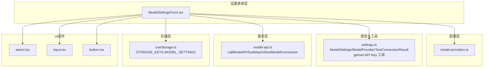
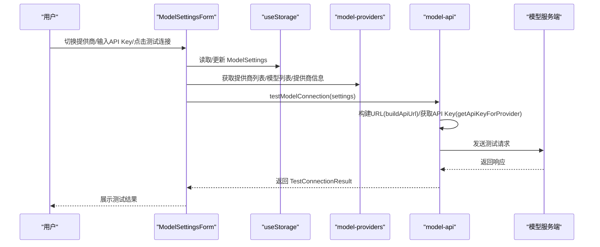
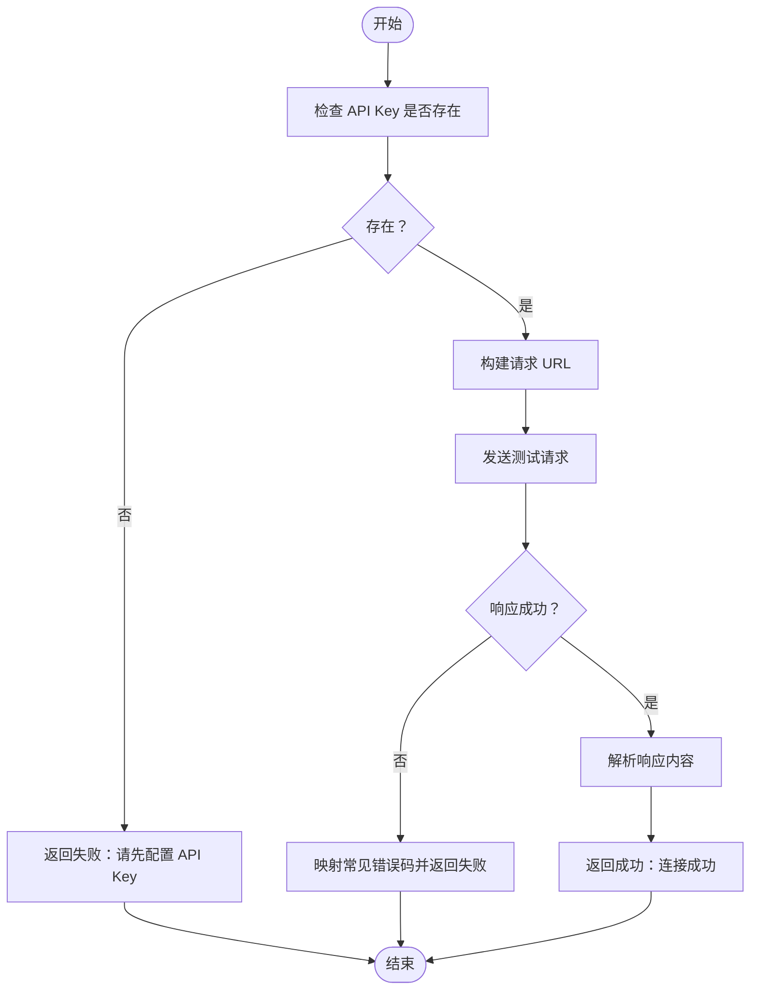
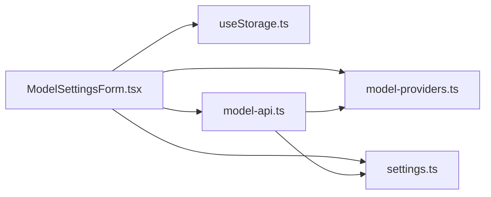

# AI模型设置

<cite>
**本文引用的文件**
- [ModelSettingsForm.tsx](file://src/features/popup/settings/ModelSettingsForm.tsx)
- [model-providers.ts](file://src/config/model-providers.ts)
- [settings.ts](file://src/types/settings.ts)
- [model-api.ts](file://src/services/model-api.ts)
- [useStorage.ts](file://src/hooks/useStorage.ts)
- [select.tsx](file://src/components/ui/select.tsx)
- [input.tsx](file://src/components/ui/input.tsx)
- [button.tsx](file://src/components/ui/button.tsx)
</cite>

## 目录
1. [简介](#简介)
2. [项目结构](#项目结构)
3. [核心组件](#核心组件)
4. [架构总览](#架构总览)
5. [详细组件分析](#详细组件分析)
6. [依赖关系分析](#依赖关系分析)
7. [性能考虑](#性能考虑)
8. [故障排查指南](#故障排查指南)
9. [结论](#结论)
10. [附录](#附录)

## 简介
本文件面向需要在浏览器插件中配置多种国产大模型提供商（如 DeepSeek、通义千问、Kimi、火山引擎、智谱 AI、百川智能等）的用户与开发者，系统性说明如何通过 ModelSettingsForm 组件完成模型提供商选择、模型类型切换、API Key 输入与验证、以及自定义 OpenAI 兼容 API 的配置。同时结合 model-providers.ts 中的 MODEL_PROVIDERS 配置，解释各提供商的 baseUrl、认证方式（Bearer Token）与支持的模型列表；并通过 getApiKeyForProvider 与 setApiKeyForProvider 等工具函数，演示如何在多提供商场景下安全地存储与切换 API Key；最后给出连接测试的实现机制（TestConnectionResult 类型），帮助用户快速验证配置有效性。

## 项目结构
围绕“AI模型设置”的功能，涉及以下关键文件与职责划分：
- 表单层：ModelSettingsForm.tsx 负责渲染与交互，包括提供商选择、模型切换、API Key 输入、自定义 URL 配置、连接测试等。
- 配置层：model-providers.ts 定义各提供商的基础信息（baseUrl、认证头、模型列表等）。
- 类型与工具：settings.ts 定义 ModelSettings、ModelProvider、TestConnectionResult 等类型，并提供多提供商 API Key 的读写工具函数。
- 服务层：model-api.ts 实现构建请求 URL、调用模型 API、测试连接等核心逻辑。
- 存储层：useStorage.ts 提供跨浏览器扩展的本地存储钩子，统一读写模型设置。
- UI 组件：select、input、button 等基础 UI 组件被表单复用。

图表来源
- [ModelSettingsForm.tsx](file://src/features/popup/settings/ModelSettingsForm.tsx#L1-L298)
- [model-providers.ts](file://src/config/model-providers.ts#L1-L123)
- [settings.ts](file://src/types/settings.ts#L1-L192)
- [model-api.ts](file://src/services/model-api.ts#L1-L678)
- [useStorage.ts](file://src/hooks/useStorage.ts#L1-L102)
- [select.tsx](file://src/components/ui/select.tsx#L1-L162)
- [input.tsx](file://src/components/ui/input.tsx#L1-L27)
- [button.tsx](file://src/components/ui/button.tsx#L1-L59)

章节来源
- [ModelSettingsForm.tsx](file://src/features/popup/settings/ModelSettingsForm.tsx#L1-L298)
- [model-providers.ts](file://src/config/model-providers.ts#L1-L123)
- [settings.ts](file://src/types/settings.ts#L1-L192)
- [model-api.ts](file://src/services/model-api.ts#L1-L678)
- [useStorage.ts](file://src/hooks/useStorage.ts#L1-L102)

## 核心组件
- ModelSettingsForm：提供完整的模型设置 UI，包括提供商选择、模型列表、API Key 输入、自定义 URL、连接测试与提示信息。
- MODEL_PROVIDERS：集中定义各提供商的 id、名称、baseUrl、认证头、前缀与模型列表。
- ModelSettings/ModelProvider/TestConnectionResult：定义设置结构、提供商配置与测试结果类型。
- getApiKeyForProvider/setApiKeyForProvider：在多提供商场景下安全地读取与写入 API Key。
- callModelAPI/buildApiUrl/testModelConnection：封装请求构建、调用与测试流程。

章节来源
- [ModelSettingsForm.tsx](file://src/features/popup/settings/ModelSettingsForm.tsx#L1-L298)
- [model-providers.ts](file://src/config/model-providers.ts#L1-L123)
- [settings.ts](file://src/types/settings.ts#L1-L192)
- [model-api.ts](file://src/services/model-api.ts#L1-L678)

## 架构总览
下面的序列图展示了用户在设置界面中切换提供商、输入 API Key 并点击“测试连接”时，各模块之间的调用关系与数据流。

图表来源
- [ModelSettingsForm.tsx](file://src/features/popup/settings/ModelSettingsForm.tsx#L1-L298)
- [model-providers.ts](file://src/config/model-providers.ts#L1-L123)
- [settings.ts](file://src/types/settings.ts#L1-L192)
- [model-api.ts](file://src/services/model-api.ts#L1-L678)
- [useStorage.ts](file://src/hooks/useStorage.ts#L1-L102)

## 详细组件分析

### ModelSettingsForm 组件
- 功能要点
  - 提供商选择：通过下拉框选择模型提供商，切换时清空已选模型并刷新模型列表。
  - 模型切换：根据当前提供商动态加载可用模型；当提供商为“自定义”时禁用模型选择。
  - API Key 管理：按提供商独立存储 API Key；切换提供商时自动加载对应 Key；输入框类型为密码。
  - 自定义 OpenAI 兼容 API：当提供商为“custom”时显示自定义 URL 输入框，默认追加 /chat/completions。
  - 连接测试：调用 testModelConnection，展示成功/失败消息；测试期间禁用按钮。
  - 存储与加载：通过 useStorage 读取/写入 STORAGE_KEYS.MODEL_SETTINGS，支持浏览器扩展与开发环境降级。

- 关键交互逻辑
  - 切换提供商时，重置模型选择并清除测试结果。
  - 输入 API Key 时，使用 setApiKeyForProvider 写入 settings.apiKeys。
  - 测试连接时，若 API Key 缺失则直接返回失败；否则调用 callModelAPI 发起一次简短测试请求。

- UI 组件复用
  - Select/Input/Button 分别用于提供商选择、API Key 输入与测试按钮。

章节来源
- [ModelSettingsForm.tsx](file://src/features/popup/settings/ModelSettingsForm.tsx#L1-L298)
- [select.tsx](file://src/components/ui/select.tsx#L1-L162)
- [input.tsx](file://src/components/ui/input.tsx#L1-L27)
- [button.tsx](file://src/components/ui/button.tsx#L1-L59)

### PROVIDER 配置结构与模型列表
- MODEL_PROVIDERS 定义了各提供商的 id、名称、baseUrl、认证头与前缀、以及支持的模型列表。
- 支持的提供商包括：火山引擎、DeepSeek、Kimi、通义千问、智谱 AI、百川智能，以及“自定义（OpenAI 兼容）”。
- 各提供商均采用 Bearer Token 认证方式，通过 Authorization 头与 “Bearer ” 前缀拼接 API Key。

章节来源
- [model-providers.ts](file://src/config/model-providers.ts#L1-L123)

### API Key 管理工具函数
- getApiKeyForProvider
  - 优先从 settings.apiKeys[providerId] 读取；若不存在则回退到旧版 settings.apiKey；均不存在则返回空字符串。
  - 保证在多提供商场景下，每个提供商拥有独立的 API Key。
- setApiKeyForProvider
  - 返回一个新的 ModelSettings 对象，将指定 providerId 的 API Key 写入 settings.apiKeys。

- 存储与兼容性
  - defaultModelSettings 初始化 apiKeys 为空对象，兼容旧版单一 apiKey 字段。
  - 通过 useStorage 将 ModelSettings 持久化到浏览器扩展存储或本地开发环境。

章节来源
- [settings.ts](file://src/types/settings.ts#L1-L192)
- [useStorage.ts](file://src/hooks/useStorage.ts#L1-L102)

### 连接测试与错误处理
- TestConnectionResult
  - 字段：success、message、response（可选）。
- testModelConnection
  - 若 API Key 缺失，直接返回失败提示。
  - 否则调用 callModelAPI 发起一次简短测试请求（降低温度与令牌上限），解析响应并返回结果。
- callModelAPI
  - 构建 URL：当 provider 为 custom 时，确保 URL 以 /chat/completions 结尾；否则使用 MODEL_PROVIDERS.baseUrl + /chat/completions。
  - 认证：使用 provider.authHeader 与 provider.authPrefix + apiKey。
  - 错误处理：对 401、429、400 等常见状态码给出明确提示；其他错误统一包装为可读消息。
  - 响应解析：优先提取 choices[0].message.content；兼容部分平台的 output.text 或 result 字段。

图表来源
- [settings.ts](file://src/types/settings.ts#L116-L122)
- [model-api.ts](file://src/services/model-api.ts#L141-L174)
- [model-api.ts](file://src/services/model-api.ts#L35-L140)

章节来源
- [settings.ts](file://src/types/settings.ts#L116-L122)
- [model-api.ts](file://src/services/model-api.ts#L141-L174)
- [model-api.ts](file://src/services/model-api.ts#L35-L140)

### 自定义 OpenAI 兼容 API 配置
- 当提供商选择为 custom 时：
  - 显示自定义 URL 输入框，允许用户填入 OpenAI 兼容风格的 API 基础地址。
  - buildApiUrl 会自动去除末尾多余斜杠，并在末尾补全 /chat/completions，确保与 OpenAI 接口一致。
- 适用于希望对接第三方或私有部署的 OpenAI 兼容服务。

章节来源
- [ModelSettingsForm.tsx](file://src/features/popup/settings/ModelSettingsForm.tsx#L192-L209)
- [model-api.ts](file://src/services/model-api.ts#L17-L33)

## 依赖关系分析
- ModelSettingsForm 依赖
  - useStorage：读写模型设置。
  - model-providers：提供提供商列表、模型列表与提供商信息。
  - settings：提供 API Key 工具函数与默认设置。
  - model-api：提供测试连接与调用模型 API 的能力。
- model-api 依赖
  - settings：获取 API Key。
  - model-providers：获取 baseUrl、认证头与前缀。
- UI 组件
  - select/input/button 由 ModelSettingsForm 直接使用。

图表来源
- [ModelSettingsForm.tsx](file://src/features/popup/settings/ModelSettingsForm.tsx#L1-L298)
- [model-providers.ts](file://src/config/model-providers.ts#L1-L123)
- [settings.ts](file://src/types/settings.ts#L1-L192)
- [model-api.ts](file://src/services/model-api.ts#L1-L678)
- [useStorage.ts](file://src/hooks/useStorage.ts#L1-L102)

章节来源
- [ModelSettingsForm.tsx](file://src/features/popup/settings/ModelSettingsForm.tsx#L1-L298)
- [model-providers.ts](file://src/config/model-providers.ts#L1-L123)
- [settings.ts](file://src/types/settings.ts#L1-L192)
- [model-api.ts](file://src/services/model-api.ts#L1-L678)
- [useStorage.ts](file://src/hooks/useStorage.ts#L1-L102)

## 性能考虑
- 测试连接时降低温度与最大令牌数，减少网络与成本开销。
- 在一键优化简历场景中，对并发请求增加短暂延迟，避免触发限流。
- UI 层尽量使用受控组件与 useMemo 缓存当前提供商名称，减少不必要的重渲染。

## 故障排查指南
- API Key 无效
  - 现象：测试连接返回认证失败。
  - 排查：确认 API Key 是否正确、是否与所选提供商匹配；检查提供商是否启用相应模型。
- 模型不可用
  - 现象：模型下拉为空或不可选。
  - 排查：确认已选择正确的提供商；当提供商为“自定义”时，模型需在自定义 URL 的平台上预先创建。
- 请求过于频繁
  - 现象：返回请求过于频繁。
  - 排查：降低调用频率，或升级提供商套餐。
- 自定义 URL 配置错误
  - 现象：无法连接或接口报错。
  - 排查：确保 URL 末尾包含 /chat/completions；若缺少，buildApiUrl 会自动补全。
- 旧版配置迁移
  - 现象：切换提供商后 API Key 未生效。
  - 排查：系统会回退到旧版 apiKey 字段；建议在设置中重新输入并保存，以便迁移到 apiKeys 结构。

章节来源
- [model-api.ts](file://src/services/model-api.ts#L98-L139)
- [settings.ts](file://src/types/settings.ts#L49-L77)

## 结论
通过 ModelSettingsForm 与 MODEL_PROVIDERS 的配合，用户可以便捷地在多种国产大模型提供商之间切换，并以 Bearer Token 方式安全地管理各自的 API Key。借助自定义 OpenAI 兼容 API，用户还能灵活对接第三方或私有部署的服务。测试连接机制与错误映射帮助用户快速定位问题，提升整体使用体验。

## 附录

### 常见提供商与配置要点
- 火山引擎（volcengine）
  - 认证头：Authorization
  - 前缀：Bearer
  - baseUrl：见配置文件
  - 支持模型：见配置文件
- DeepSeek（deepseek）
  - 认证头：Authorization
  - 前缀：Bearer
  - baseUrl：见配置文件
  - 支持模型：见配置文件
- Kimi（kimi）
  - 认证头：Authorization
  - 前缀：Bearer
  - baseUrl：见配置文件
  - 支持模型：见配置文件
- 通义千问（qwen）
  - 认证头：Authorization
  - 前缀：Bearer
  - baseUrl：见配置文件
  - 支持模型：见配置文件
- 智谱 AI（zhipu）
  - 认证头：Authorization
  - 前缀：Bearer
  - baseUrl：见配置文件
  - 支持模型：见配置文件
- 百川智能（baichuan）
  - 认证头：Authorization
  - 前缀：Bearer
  - baseUrl：见配置文件
  - 支持模型：见配置文件
- 自定义（custom）
  - 认证头：Authorization
  - 前缀：Bearer
  - baseUrl：留空，由用户填写完整 URL
  - 支持模型：留空，由用户在自定义平台创建

章节来源
- [model-providers.ts](file://src/config/model-providers.ts#L1-L123)

### 示例：如何安全存储与切换多个提供商
- 步骤
  1) 在设置界面选择提供商 A，输入并保存 API Key A。
  2) 切换到提供商 B，输入并保存 API Key B。
  3) 切换回提供商 A，确认 API Key A 自动加载。
- 依据
  - getApiKeyForProvider 会优先从 settings.apiKeys[providerId] 读取。
  - setApiKeyForProvider 会将新值写入 settings.apiKeys[providerId]。
  - useStorage 会持久化保存整个 ModelSettings。

章节来源
- [settings.ts](file://src/types/settings.ts#L49-L77)
- [useStorage.ts](file://src/hooks/useStorage.ts#L1-L102)