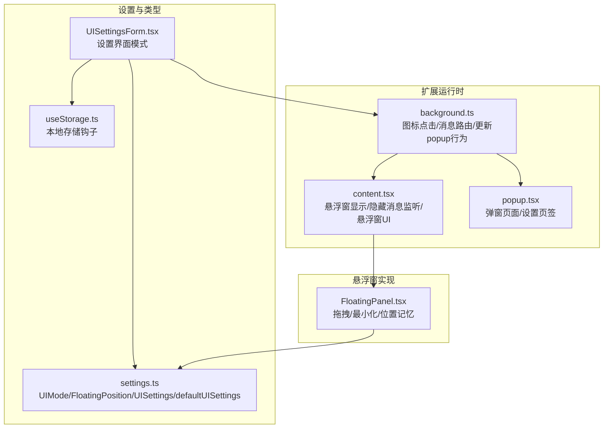
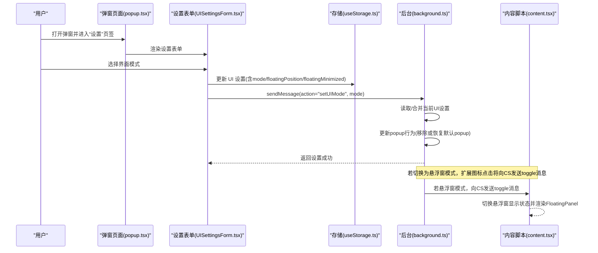
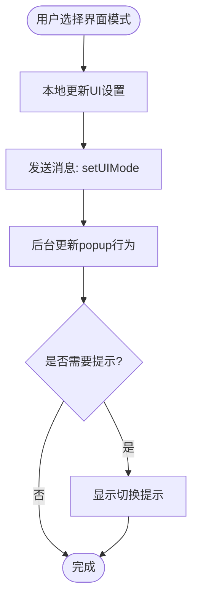
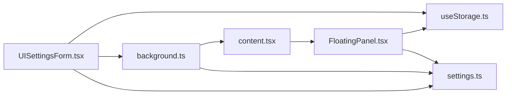

# 界面设置

<cite>
**本文引用的文件**
- [src/features/popup/settings/UISettingsForm.tsx](file://src/features/popup/settings/UISettingsForm.tsx)
- [src/types/settings.ts](file://src/types/settings.ts)
- [src/hooks/useStorage.ts](file://src/hooks/useStorage.ts)
- [src/background.ts](file://src/background.ts)
- [src/content.tsx](file://src/content.tsx)
- [src/popup.tsx](file://src/popup.tsx)
- [src/components/floating/FloatingPanel.tsx](file://src/components/floating/FloatingPanel.tsx)
</cite>

## 目录
1. [简介](#简介)
2. [项目结构](#项目结构)
3. [核心组件](#核心组件)
4. [架构总览](#架构总览)
5. [详细组件分析](#详细组件分析)
6. [依赖关系分析](#依赖关系分析)
7. [性能考量](#性能考量)
8. [故障排查指南](#故障排查指南)
9. [结论](#结论)
10. [附录](#附录)

## 简介
本文件围绕插件界面行为配置进行系统化说明，重点聚焦 UISettingsForm 组件及其与 UIMode 类型（'popup' 与 'floating'）的关系，解释用户如何在弹窗模式与悬浮窗模式之间切换，并阐述 floatingPosition 和 floatingMinimized 如何控制悬浮窗的位置记忆与最小化状态。结合 defaultUISettings 默认配置，分析界面状态持久化机制，给出在不同招聘网站中的实际使用场景建议，并说明该配置如何影响 content.tsx 与 popup.tsx 的渲染逻辑，以及 FloatingPosition 接口在 DOM 定位中的应用。

## 项目结构
与界面设置相关的关键文件分布如下：
- 设置表单组件：src/features/popup/settings/UISettingsForm.tsx
- 类型定义与默认配置：src/types/settings.ts
- 存储钩子：src/hooks/useStorage.ts
- 背景脚本（扩展图标点击、消息路由、popup 行为切换）：src/background.ts
- 内容脚本（悬浮窗显示/隐藏消息监听、悬浮窗 UI 渲染）：src/content.tsx
- 弹窗页面（包含设置页签）：src/popup.tsx
- 悬浮窗面板组件（拖拽、最小化、位置记忆）：src/components/floating/FloatingPanel.tsx

图表来源
- [src/features/popup/settings/UISettingsForm.tsx](file://src/features/popup/settings/UISettingsForm.tsx#L1-L115)
- [src/types/settings.ts](file://src/types/settings.ts#L85-L107)
- [src/hooks/useStorage.ts](file://src/hooks/useStorage.ts#L1-L102)
- [src/background.ts](file://src/background.ts#L1-L78)
- [src/content.tsx](file://src/content.tsx#L1-L152)
- [src/popup.tsx](file://src/popup.tsx#L1-L300)
- [src/components/floating/FloatingPanel.tsx](file://src/components/floating/FloatingPanel.tsx#L1-L414)

章节来源
- [src/features/popup/settings/UISettingsForm.tsx](file://src/features/popup/settings/UISettingsForm.tsx#L1-L115)
- [src/types/settings.ts](file://src/types/settings.ts#L85-L107)
- [src/hooks/useStorage.ts](file://src/hooks/useStorage.ts#L1-L102)
- [src/background.ts](file://src/background.ts#L1-L78)
- [src/content.tsx](file://src/content.tsx#L1-L152)
- [src/popup.tsx](file://src/popup.tsx#L1-L300)
- [src/components/floating/FloatingPanel.tsx](file://src/components/floating/FloatingPanel.tsx#L1-L414)

## 核心组件
- UISettingsForm：提供界面模式选择（弹窗/悬浮窗），并在用户切换时通过消息通知背景脚本更新 popup 行为，同时显示切换提示。
- defaultUISettings：定义默认界面设置，包括 mode、floatingPosition、floatingMinimized。
- FloatingPosition：定义悬浮窗位置坐标（x/y）。
- useStorage：封装 Chrome 本地存储读取/写入与变更监听，支持开发环境降级到 localStorage。
- background.ts：处理扩展图标点击事件，根据 UI 设置决定是显示弹窗还是向 content script 发送切换悬浮窗的消息；同时监听设置变更并动态调整 popup 行为。
- content.tsx：监听来自 popup/background 的消息，控制悬浮窗显示/隐藏；在悬浮窗模式下渲染 FloatingPanel。
- popup.tsx：弹窗页面，包含“简历填写”和“设置”两个页签，其中“设置”页签内嵌 UISettingsForm。
- FloatingPanel：悬浮窗面板，支持拖拽、最小化、位置记忆与最小化状态记忆。

章节来源
- [src/features/popup/settings/UISettingsForm.tsx](file://src/features/popup/settings/UISettingsForm.tsx#L1-L115)
- [src/types/settings.ts](file://src/types/settings.ts#L85-L107)
- [src/hooks/useStorage.ts](file://src/hooks/useStorage.ts#L1-L102)
- [src/background.ts](file://src/background.ts#L1-L78)
- [src/content.tsx](file://src/content.tsx#L1-L152)
- [src/popup.tsx](file://src/popup.tsx#L1-L300)
- [src/components/floating/FloatingPanel.tsx](file://src/components/floating/FloatingPanel.tsx#L1-L414)

## 架构总览
以下序列图展示了用户在设置页切换界面模式时，从 UI 到扩展运行时再到内容脚本的完整流程。

图表来源
- [src/popup.tsx](file://src/popup.tsx#L190-L294)
- [src/features/popup/settings/UISettingsForm.tsx](file://src/features/popup/settings/UISettingsForm.tsx#L19-L45)
- [src/hooks/useStorage.ts](file://src/hooks/useStorage.ts#L61-L88)
- [src/background.ts](file://src/background.ts#L11-L29)
- [src/background.ts](file://src/background.ts#L31-L78)
- [src/content.tsx](file://src/content.tsx#L69-L122)

章节来源
- [src/popup.tsx](file://src/popup.tsx#L190-L294)
- [src/features/popup/settings/UISettingsForm.tsx](file://src/features/popup/settings/UISettingsForm.tsx#L19-L45)
- [src/hooks/useStorage.ts](file://src/hooks/useStorage.ts#L61-L88)
- [src/background.ts](file://src/background.ts#L11-L29)
- [src/background.ts](file://src/background.ts#L31-L78)
- [src/content.tsx](file://src/content.tsx#L69-L122)

## 详细组件分析

### UISettingsForm 组件
- 功能要点
  - 读取并展示当前 UI 设置（mode、floatingPosition、floatingMinimized）。
  - 用户切换模式时，先本地更新设置，再通过 runtime.sendMessage 通知 background.ts 更新 popup 行为，并显示切换提示。
  - 在悬浮窗模式说明中提示拖拽、最小化与位置记忆等特性。
- 关键交互
  - 通过 useStorage 读取/写入 STORAGE_KEYS.UI_SETTINGS。
  - 通过 chrome.runtime.sendMessage 触发 setUIMode。
- 与默认配置的关系
  - 使用 defaultUISettings 作为初始默认值，确保首次使用时具备合理默认行为。

图表来源
- [src/features/popup/settings/UISettingsForm.tsx](file://src/features/popup/settings/UISettingsForm.tsx#L19-L45)
- [src/hooks/useStorage.ts](file://src/hooks/useStorage.ts#L61-L88)
- [src/background.ts](file://src/background.ts#L42-L57)

章节来源
- [src/features/popup/settings/UISettingsForm.tsx](file://src/features/popup/settings/UISettingsForm.tsx#L1-L115)
- [src/hooks/useStorage.ts](file://src/hooks/useStorage.ts#L1-L102)
- [src/background.ts](file://src/background.ts#L42-L57)

### UIMode 类型与模式切换
- UIMode 定义：'popup' 与 'floating'
- 切换逻辑
  - 弹窗模式：扩展图标点击由 Plasmo 自动显示 popup.html。
  - 悬浮窗模式：扩展图标点击由 background.ts 向 content script 发送 toggleFloatingPanel 消息，content script 控制 FloatingPanel 显示/隐藏。
- 切换提示
  - UISettingsForm 在切换完成后显示相应提示，帮助用户理解后续行为。

章节来源
- [src/types/settings.ts](file://src/types/settings.ts#L85-L87)
- [src/background.ts](file://src/background.ts#L11-L29)
- [src/content.tsx](file://src/content.tsx#L69-L122)
- [src/features/popup/settings/UISettingsForm.tsx](file://src/features/popup/settings/UISettingsForm.tsx#L31-L45)

### floatingPosition 与 floatingMinimized 的作用
- floatingPosition
  - 类型：FloatingPosition（包含 x、y 坐标）。
  - 用途：记录悬浮窗上次拖拽后的屏幕坐标，以便下次打开时恢复到相同位置。
  - 读取与保存
    - FloatingPanel 首次渲染时从 UI 设置读取 floatingPosition 并设置初始位置。
    - 拖拽结束后将新位置写回 UI 设置，实现位置记忆。
- floatingMinimized
  - 类型：boolean。
  - 用途：记录悬浮窗的最小化状态。
  - 读取与保存
    - FloatingPanel 首次渲染时从 UI 设置读取 floatingMinimized 并决定初始显示形态。
    - 切换最小化状态时同步更新 UI 设置，实现最小化状态记忆。

章节来源
- [src/types/settings.ts](file://src/types/settings.ts#L88-L99)
- [src/components/floating/FloatingPanel.tsx](file://src/components/floating/FloatingPanel.tsx#L123-L171)
- [src/components/floating/FloatingPanel.tsx](file://src/components/floating/FloatingPanel.tsx#L226-L235)

### defaultUISettings 默认配置与持久化机制
- defaultUISettings
  - mode: 'popup'
  - floatingPosition: { x: 20, y: 20 }
  - floatingMinimized: false
- 持久化机制
  - useStorage 通过 chrome.storage.local 或开发环境降级到 localStorage 进行读写。
  - 支持 onChanged 监听，保证多实例间状态同步。
  - UISettingsForm 与 FloatingPanel 均使用同一存储键 UI_SETTINGS，确保模式、位置与最小化状态统一持久化。

章节来源
- [src/types/settings.ts](file://src/types/settings.ts#L101-L107)
- [src/hooks/useStorage.ts](file://src/hooks/useStorage.ts#L1-L102)
- [src/features/popup/settings/UISettingsForm.tsx](file://src/features/popup/settings/UISettingsForm.tsx#L19-L23)
- [src/components/floating/FloatingPanel.tsx](file://src/components/floating/FloatingPanel.tsx#L146-L149)

### 对 content.tsx 与 popup.tsx 的影响
- 对 popup.tsx 的影响
  - 弹窗页面包含“设置”页签，其中嵌套 UISettingsForm，用户可在弹窗内完成模式切换。
- 对 content.tsx 的影响
  - 悬浮窗模式下，content script 监听 toggle/show/hide 消息，控制 FloatingPanel 的显示/隐藏与可见性状态。
  - content script 通过 window.addEventListener 接收来自悬浮窗内部的自定义事件（例如字段填充模式启动），并与后台交互。

章节来源
- [src/popup.tsx](file://src/popup.tsx#L190-L294)
- [src/content.tsx](file://src/content.tsx#L69-L122)
- [src/content.tsx](file://src/content.tsx#L128-L151)

### FloatingPosition 接口在 DOM 定位中的应用
- FloatingPanel 使用固定定位（position: fixed），通过 style.left/top 将面板放置在屏幕坐标 (x, y)。
- 拖拽过程计算新的位置并限制在可视区域内，拖拽结束时保存到 UI 设置。
- 最小化形态下仍保留当前位置，便于展开时恢复。

章节来源
- [src/components/floating/FloatingPanel.tsx](file://src/components/floating/FloatingPanel.tsx#L271-L281)
- [src/components/floating/FloatingPanel.tsx](file://src/components/floating/FloatingPanel.tsx#L173-L207)
- [src/components/floating/FloatingPanel.tsx](file://src/components/floating/FloatingPanel.tsx#L236-L269)

## 依赖关系分析
- 组件耦合
  - UISettingsForm 依赖 useStorage 与 defaultUISettings，通过消息与 background.ts 解耦。
  - FloatingPanel 依赖 useStorage 与 defaultUISettings，负责 UI 状态与 DOM 定位。
  - background.ts 依赖 STORAGE_KEYS.UI_SETTINGS 与 defaultUISettings，协调 popup 行为与 content script 通信。
  - content.tsx 依赖 FloatingPanel，通过消息控制其显示/隐藏。
- 外部依赖
  - Chrome Extension API：runtime、storage、action、tabs。
  - Plasmo：content script 配置与样式注入。

图表来源
- [src/features/popup/settings/UISettingsForm.tsx](file://src/features/popup/settings/UISettingsForm.tsx#L1-L115)
- [src/hooks/useStorage.ts](file://src/hooks/useStorage.ts#L1-L102)
- [src/background.ts](file://src/background.ts#L1-L78)
- [src/content.tsx](file://src/content.tsx#L1-L152)
- [src/components/floating/FloatingPanel.tsx](file://src/components/floating/FloatingPanel.tsx#L1-L414)
- [src/types/settings.ts](file://src/types/settings.ts#L85-L107)

章节来源
- [src/features/popup/settings/UISettingsForm.tsx](file://src/features/popup/settings/UISettingsForm.tsx#L1-L115)
- [src/hooks/useStorage.ts](file://src/hooks/useStorage.ts#L1-L102)
- [src/background.ts](file://src/background.ts#L1-L78)
- [src/content.tsx](file://src/content.tsx#L1-L152)
- [src/components/floating/FloatingPanel.tsx](file://src/components/floating/FloatingPanel.tsx#L1-L414)
- [src/types/settings.ts](file://src/types/settings.ts#L85-L107)

## 性能考量
- 拖拽性能
  - 拖拽过程中仅更新 position 状态，避免频繁重排；拖拽结束才写入存储，减少存储写入频率。
- 存储访问
  - 使用 useStorage 的异步写入与 onChanged 监听，避免阻塞主线程。
- DOM 层级
  - 悬浮窗使用最高 z-index，确保覆盖页面元素，但注意避免与页面自身高层级元素冲突。
- 页面加载
  - content script 仅在悬浮窗模式下渲染 FloatingPanel，减少非必要渲染。

[本节为通用指导，不直接分析具体文件]

## 故障排查指南
- 切换模式后未生效
  - 检查 background.ts 是否收到 setUIMode 消息并成功更新 popup 行为。
  - 确认 useStorage 正常写入 UI_SETTINGS 键。
- 悬浮窗无法显示
  - 检查 content script 是否已加载（background.ts 在发送消息前会捕获未就绪的情况）。
  - 确认扩展图标点击事件是否触发了 toggleFloatingPanel。
- 位置记忆丢失
  - 检查 FloatingPanel 是否正确从 UI 设置读取 floatingPosition 并在拖拽结束时保存。
- 最小化状态异常
  - 检查 floatingMinimized 是否被正确读取与保存。

章节来源
- [src/background.ts](file://src/background.ts#L11-L29)
- [src/background.ts](file://src/background.ts#L31-L78)
- [src/content.tsx](file://src/content.tsx#L69-L122)
- [src/components/floating/FloatingPanel.tsx](file://src/components/floating/FloatingPanel.tsx#L151-L171)
- [src/components/floating/FloatingPanel.tsx](file://src/components/floating/FloatingPanel.tsx#L226-L235)

## 结论
UISettingsForm 通过简洁的 UI 与消息机制实现了界面模式的无缝切换，配合 defaultUISettings 与 useStorage 的持久化能力，确保用户在不同招聘网站与使用场景中都能获得一致的交互体验。floatingPosition 与 floatingMinimized 的引入进一步提升了悬浮窗的可用性与个性化程度。整体架构清晰、职责分离明确，便于维护与扩展。

[本节为总结性内容，不直接分析具体文件]

## 附录

### 实际使用场景示例
- 在招聘网站 A 上偏好“悬浮窗模式”
  - 优点：可随时拖拽到合适位置，最小化后仍可通过最小化形态快速展开。
  - 操作：在设置页选择“悬浮窗模式”，拖拽到右下角，最小化后继续浏览页面。
- 在招聘网站 B 上偏好“弹窗模式”
  - 优点：点击图标即弹出，适合快速填写与导出。
  - 操作：在设置页选择“弹窗模式”，关闭弹窗后再次点击图标即可唤起。
- 在多标签页场景
  - 悬浮窗模式：适合在多个标签页间切换时保持工具面板可见。
  - 弹窗模式：适合一次性操作后快速关闭，避免干扰页面布局。

[本节为概念性说明，不直接分析具体文件]