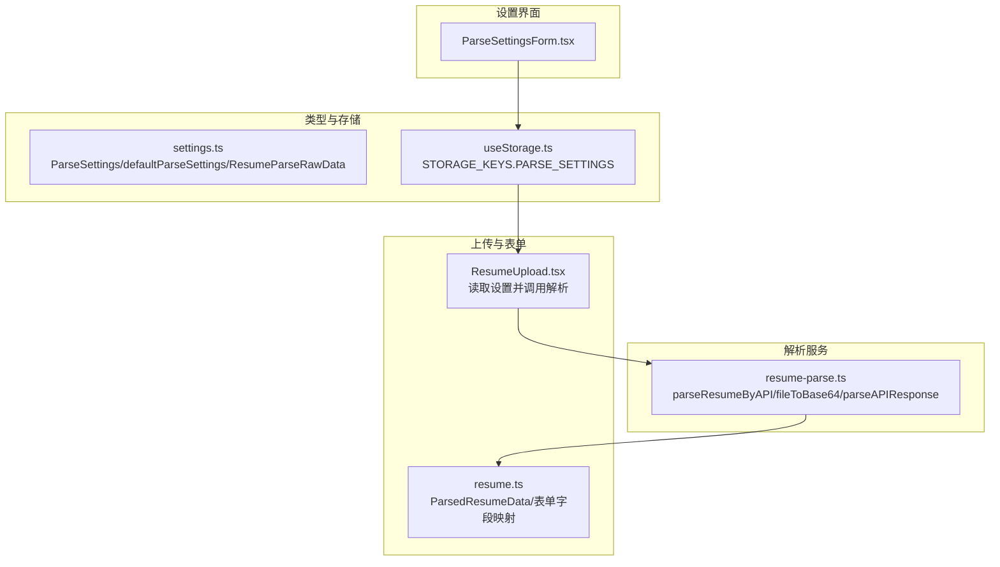
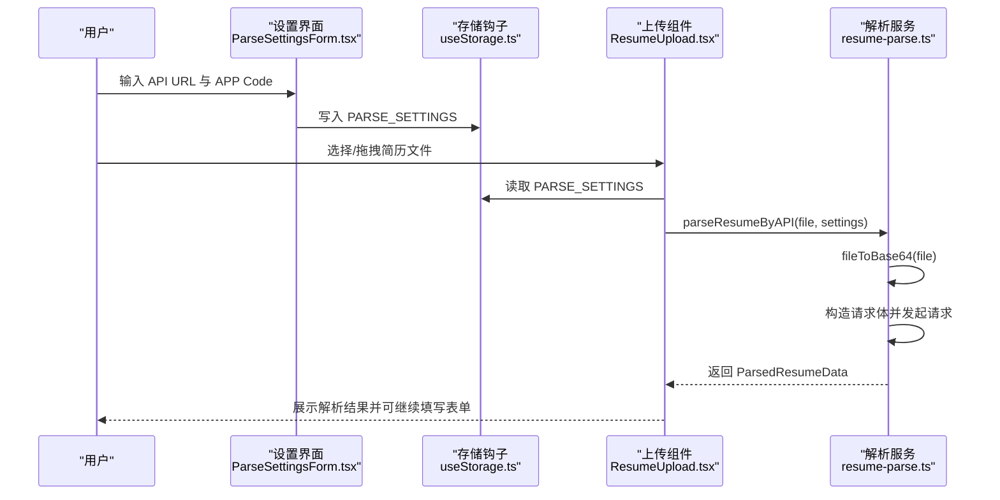
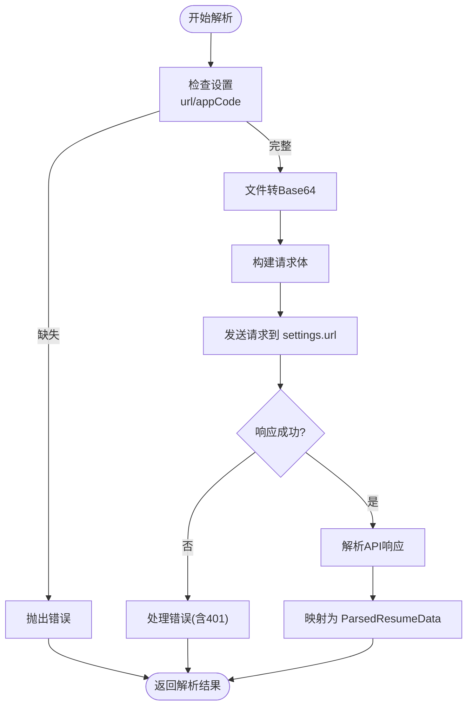
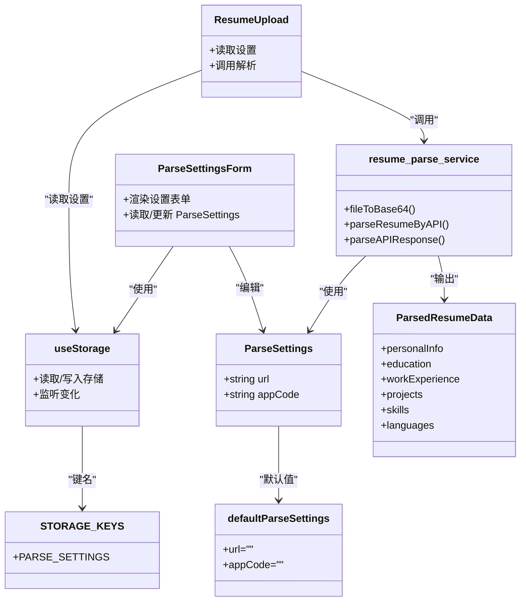

# 简历解析设置

<cite>
**本文引用的文件**
- [ParseSettingsForm.tsx](file://src/features/popup/settings/ParseSettingsForm.tsx)
- [settings.ts](file://src/types/settings.ts)
- [resume-parse.ts](file://src/services/resume-parse.ts)
- [useStorage.ts](file://src/hooks/useStorage.ts)
- [ResumeUpload.tsx](file://src/features/popup/ResumeUpload.tsx)
- [resume.ts](file://src/types/resume.ts)
</cite>

## 目录
1. [简介](#简介)
2. [项目结构](#项目结构)
3. [核心组件](#核心组件)
4. [架构总览](#架构总览)
5. [详细组件分析](#详细组件分析)
6. [依赖关系分析](#依赖关系分析)
7. [性能考量](#性能考量)
8. [故障排查指南](#故障排查指南)
9. [结论](#结论)
10. [附录](#附录)

## 简介
本文件围绕“简历解析服务配置”展开，重点解释 ParseSettingsForm 组件如何让用户配置阿里云简历解析 API 的接入参数，详解 ParseSettings 类型中的 url 与 appCode 字段在调用第三方简历解析服务时的身份认证机制；结合 defaultParseSettings 默认值配置，阐述初始化逻辑与用户输入验证规则；并给出配置错误的常见场景（如无效 URL、过期 AppCode）及解决方案。最后说明该设置如何与 resume-parse.ts 服务模块协同工作，完成 PDF/DOCX 简历文件的智能解析流程，并引用 ResumeParseRawData 接口定义解析返回的数据结构。

## 项目结构
简历解析相关的配置与调用分布在以下模块：
- 设置界面：ParseSettingsForm.tsx 提供用户输入入口
- 类型定义：settings.ts 定义 ParseSettings 与默认值 defaultParseSettings，以及 ResumeParseRawData
- 存储钩子：useStorage.ts 提供跨页面持久化读写
- 解析服务：resume-parse.ts 实现文件转 Base64、调用 API、解析响应
- 上传与集成：ResumeUpload.tsx 在上传环节读取设置并触发解析
- 表单数据模型：resume.ts 定义前端表单使用的数据结构（与解析结果映射）

图表来源
- [ParseSettingsForm.tsx](file://src/features/popup/settings/ParseSettingsForm.tsx#L1-L99)
- [settings.ts](file://src/types/settings.ts#L32-L84)
- [useStorage.ts](file://src/hooks/useStorage.ts#L93-L101)
- [resume-parse.ts](file://src/services/resume-parse.ts#L38-L109)
- [ResumeUpload.tsx](file://src/features/popup/ResumeUpload.tsx#L17-L26)
- [resume.ts](file://src/types/resume.ts#L11-L212)

章节来源
- [ParseSettingsForm.tsx](file://src/features/popup/settings/ParseSettingsForm.tsx#L1-L99)
- [settings.ts](file://src/types/settings.ts#L32-L84)
- [useStorage.ts](file://src/hooks/useStorage.ts#L93-L101)
- [resume-parse.ts](file://src/services/resume-parse.ts#L38-L109)
- [ResumeUpload.tsx](file://src/features/popup/ResumeUpload.tsx#L17-L26)
- [resume.ts](file://src/types/resume.ts#L11-L212)

## 核心组件
- ParseSettingsForm：提供“API URL”和“APP Code”的输入控件，绑定到本地存储键 PARSE_SETTINGS，默认值来自 defaultParseSettings。
- ParseSettings 类型：包含 url 与 appCode 两个字段，用于标识第三方简历解析服务地址与身份凭证。
- defaultParseSettings：默认值均为空字符串，确保首次使用时明确要求用户填写。
- useStorage：封装 Chrome Storage 读写，负责初始化、持久化与跨实例同步。
- resume-parse 服务：实现文件 Base64 编码、向第三方 API 发起请求、处理响应并转换为前端可用的 ParsedResumeData 结构。
- ResumeUpload：在上传环节读取 ParseSettings，校验必填项，调用解析服务并将结果回传给表单。

章节来源
- [ParseSettingsForm.tsx](file://src/features/popup/settings/ParseSettingsForm.tsx#L1-L99)
- [settings.ts](file://src/types/settings.ts#L32-L84)
- [useStorage.ts](file://src/hooks/useStorage.ts#L1-L88)
- [resume-parse.ts](file://src/services/resume-parse.ts#L38-L109)
- [ResumeUpload.tsx](file://src/features/popup/ResumeUpload.tsx#L17-L26)

## 架构总览
下面以序列图展示从用户在设置页填写参数，到上传简历并调用解析服务的完整流程。

图表来源
- [ParseSettingsForm.tsx](file://src/features/popup/settings/ParseSettingsForm.tsx#L1-L99)
- [useStorage.ts](file://src/hooks/useStorage.ts#L93-L101)
- [ResumeUpload.tsx](file://src/features/popup/ResumeUpload.tsx#L37-L89)
- [resume-parse.ts](file://src/services/resume-parse.ts#L38-L109)

## 详细组件分析

### ParseSettingsForm 组件
- 初始化逻辑：通过 useStorage 读取 PARSE_SETTINGS 键，若无则使用 defaultParseSettings 作为初始值，保证首次渲染安全。
- 用户输入：
  - API URL：文本输入，用于指定第三方简历解析服务的访问地址。
  - APP Code：密码输入，用于身份认证。
- 输入变更：通过受控组件更新 settings 并持久化到存储。
- 默认值与占位提示：组件内提供示例 URL 与 APP Code 的说明链接，帮助用户正确配置。

章节来源
- [ParseSettingsForm.tsx](file://src/features/popup/settings/ParseSettingsForm.tsx#L1-L99)
- [settings.ts](file://src/types/settings.ts#L79-L84)
- [useStorage.ts](file://src/hooks/useStorage.ts#L93-L101)

### ParseSettings 类型与默认值
- 字段定义：
  - url：第三方简历解析服务的请求地址。
  - appCode：用于身份认证的凭证。
- 默认值 defaultParseSettings：
  - url 与 appCode 初始为空字符串，确保用户必须显式填写。
- 与 ResumeParseRawData 的关系：
  - ResumeParseRawData 描述第三方 API 返回的原始字段集合，后续由 resume-parse.ts 的 parseAPIResponse 转换为前端 ParsedResumeData。

章节来源
- [settings.ts](file://src/types/settings.ts#L32-L84)
- [settings.ts](file://src/types/settings.ts#L123-L192)

### 身份认证机制（阿里云简历解析）
- 认证方式：在请求头中添加 Authorization: "APPCODE <appCode>"，符合阿里云市场 API 的认证规范。
- 请求构造：parseResumeByAPI 将文件转为 Base64，按第三方 API 文档格式构建请求体，包含文件名、Base64 内容等必要字段。
- 错误处理：
  - 当返回 401 时，抛出明确错误提示，引导用户检查 APP Code 是否正确、服务是否激活或已过期。
  - 其他错误状态将返回包含状态码与响应体的错误信息，便于定位问题。

章节来源
- [resume-parse.ts](file://src/services/resume-parse.ts#L38-L109)

### 初始化与用户输入验证规则
- 初始化：
  - useStorage 在挂载时从存储读取 PARSE_SETTINGS，若不存在则使用 defaultParseSettings。
  - STORAGE_KEYS.PARSE_SETTINGS 作为键名，确保全局一致。
- 输入验证：
  - 上传前校验：ResumeUpload 在解析非 JSON 文件时，若 settings.url 或 settings.appCode 为空，立即提示“请先在设置中配置简历解析 API URL 和 APP Code”，避免无效请求。
  - 解析服务侧校验：parseResumeByAPI 在请求前也对 url 与 appCode 进行完整性检查，缺失时抛错。

章节来源
- [useStorage.ts](file://src/hooks/useStorage.ts#L1-L88)
- [useStorage.ts](file://src/hooks/useStorage.ts#L93-L101)
- [ResumeUpload.tsx](file://src/features/popup/ResumeUpload.tsx#L64-L69)
- [resume-parse.ts](file://src/services/resume-parse.ts#L48-L51)

### 解析流程与数据映射
- 文件处理：fileToBase64 将 File 对象转换为 Base64 字符串，去除 data URL 前缀，仅保留纯 Base64 数据。
- 请求发送：parseResumeByAPI 构造请求体并调用 settings.url，携带 Authorization 头。
- 响应解析：parseAPIResponse 支持多种响应结构（result/data/body 或直接对象），抽取个人信息、教育经历、工作/实习经历、项目经历、技能、语言能力等字段，并标准化日期与技能等级。
- 表单映射：最终输出 ParsedResumeData，前端表单可直接使用该结构进行填充。

图表来源
- [resume-parse.ts](file://src/services/resume-parse.ts#L38-L109)
- [resume-parse.ts](file://src/services/resume-parse.ts#L137-L295)

章节来源
- [resume-parse.ts](file://src/services/resume-parse.ts#L19-L33)
- [resume-parse.ts](file://src/services/resume-parse.ts#L38-L109)
- [resume-parse.ts](file://src/services/resume-parse.ts#L137-L295)

### 与表单数据结构的关系
- ResumeParseRawData：描述第三方 API 返回的原始字段集合，涵盖姓名、性别、电话、邮箱、政治面貌、期望职位、期望城市、教育/工作/项目/技能/语言等数组字段。
- ParsedResumeData：前端表单使用的统一结构，包含个人信息、教育、工作经历、项目、技能、语言能力等，便于直接填充到各表单项。

章节来源
- [settings.ts](file://src/types/settings.ts#L123-L192)
- [resume.ts](file://src/types/resume.ts#L11-L212)

## 依赖关系分析

图表来源
- [ParseSettingsForm.tsx](file://src/features/popup/settings/ParseSettingsForm.tsx#L1-L99)
- [settings.ts](file://src/types/settings.ts#L32-L84)
- [useStorage.ts](file://src/hooks/useStorage.ts#L93-L101)
- [ResumeUpload.tsx](file://src/features/popup/ResumeUpload.tsx#L17-L26)
- [resume-parse.ts](file://src/services/resume-parse.ts#L38-L109)
- [resume.ts](file://src/types/resume.ts#L11-L212)

章节来源
- [ParseSettingsForm.tsx](file://src/features/popup/settings/ParseSettingsForm.tsx#L1-L99)
- [settings.ts](file://src/types/settings.ts#L32-L84)
- [useStorage.ts](file://src/hooks/useStorage.ts#L93-L101)
- [ResumeUpload.tsx](file://src/features/popup/ResumeUpload.tsx#L17-L26)
- [resume-parse.ts](file://src/services/resume-parse.ts#L38-L109)
- [resume.ts](file://src/types/resume.ts#L11-L212)

## 性能考量
- Base64 编码：大文件转 Base64 会增加体积与内存占用，建议控制文件大小或分块处理（当前实现为一次性读取，注意大文件性能）。
- 网络请求：解析服务为外部 API，网络延迟与并发数会影响整体体验；可在 UI 上提供更细粒度的进度反馈。
- 存储读写：useStorage 采用异步写入，避免阻塞主线程；但频繁更新仍可能带来性能开销，建议合并更新或节流。

[本节为通用性能讨论，不直接分析具体文件]

## 故障排查指南
- 常见错误场景与解决方法：
  - 无效 URL：检查 settings.url 是否指向正确的阿里云简历解析服务地址；确认域名与路径正确。
  - 过期/错误的 APP Code：当收到 401 错误时，确认 APP Code 是否正确、服务是否已激活且未过期；必要时重新购买或续费。
  - 设置未配置：上传前若提示“请先在设置中配置简历解析 API URL 和 APP Code”，请回到设置页完善两项参数。
  - 不支持的文件格式：仅支持 PDF、Word、JSON、TXT、HTML；请检查文件扩展名或转换为受支持格式。
- 日志与诊断：
  - 解析服务会在关键节点打印日志（请求参数、响应状态、错误详情），便于定位问题。
  - 上传组件在异常时会显示错误消息，可据此快速修复配置。

章节来源
- [ResumeUpload.tsx](file://src/features/popup/ResumeUpload.tsx#L64-L69)
- [resume-parse.ts](file://src/services/resume-parse.ts#L82-L102)

## 结论
ParseSettingsForm 通过受控组件与 useStorage 实现了对阿里云简历解析 API 的便捷配置；ParseSettings 的 url 与 appCode 字段分别承担“服务地址”和“身份认证”的职责。defaultParseSettings 的空值设计确保用户必须显式填写；ResumeUpload 在上传阶段进行必要的完整性校验；resume-parse.ts 则完成文件编码、请求发送、响应解析与数据映射，最终输出前端可用的 ParsedResumeData。整体流程清晰、职责分离，具备良好的可维护性与扩展性。

[本节为总结性内容，不直接分析具体文件]

## 附录
- 关键接口与类型参考：
  - ParseSettings：包含 url 与 appCode
  - defaultParseSettings：默认值
  - ResumeParseRawData：第三方 API 原始返回字段
  - ParsedResumeData：前端表单映射后的结构
- 存储键名：
  - STORAGE_KEYS.PARSE_SETTINGS：简历解析设置的存储键

章节来源
- [settings.ts](file://src/types/settings.ts#L32-L84)
- [settings.ts](file://src/types/settings.ts#L79-L84)
- [settings.ts](file://src/types/settings.ts#L123-L192)
- [useStorage.ts](file://src/hooks/useStorage.ts#L93-L101)