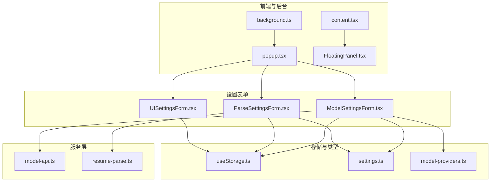
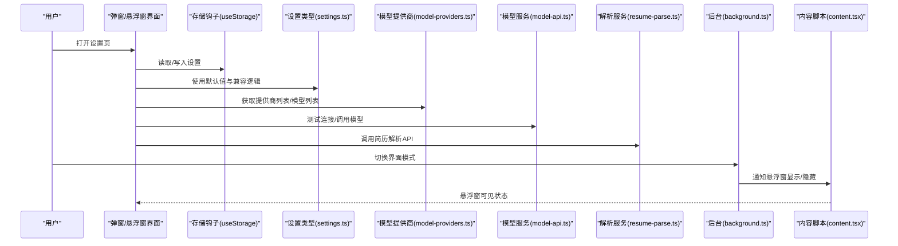
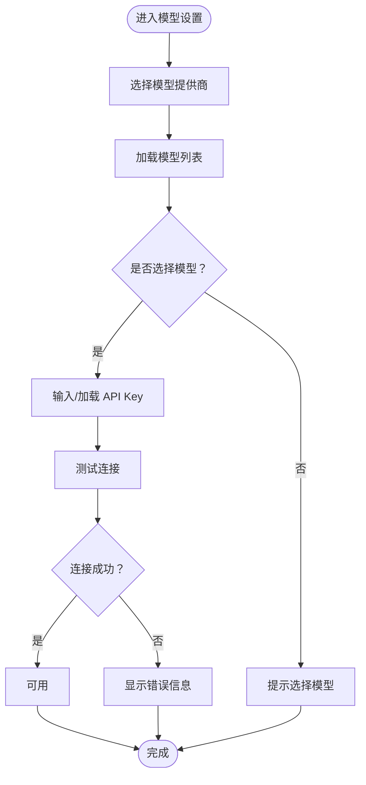
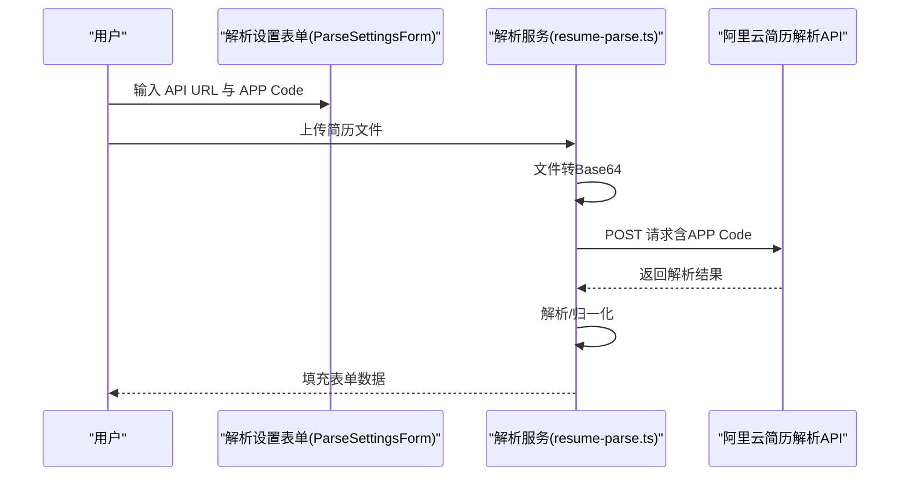
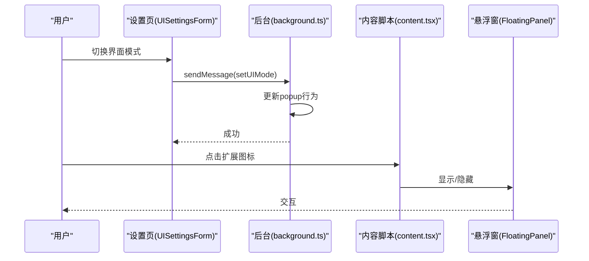
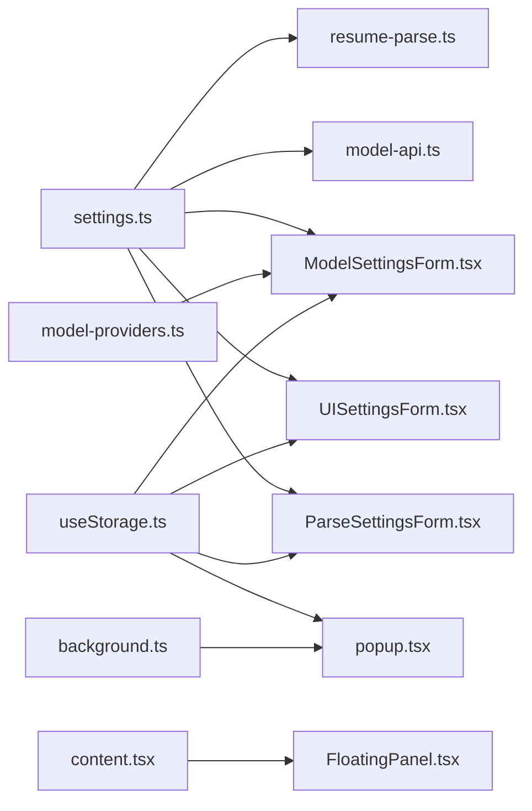

# 设置与配置

<cite>
**本文引用的文件**
- [model-providers.ts](file://src/config/model-providers.ts)
- [settings.ts](file://src/types/settings.ts)
- [model-api.ts](file://src/services/model-api.ts)
- [resume-parse.ts](file://src/services/resume-parse.ts)
- [useStorage.ts](file://src/hooks/useStorage.ts)
- [ModelSettingsForm.tsx](file://src/features/popup/settings/ModelSettingsForm.tsx)
- [ParseSettingsForm.tsx](file://src/features/popup/settings/ParseSettingsForm.tsx)
- [UISettingsForm.tsx](file://src/features/popup/settings/UISettingsForm.tsx)
- [popup.tsx](file://src/popup.tsx)
- [background.ts](file://src/background.ts)
- [content.tsx](file://src/content.tsx)
- [FloatingPanel.tsx](file://src/components/floating/FloatingPanel.tsx)
</cite>

## 目录
1. [简介](#简介)
2. [项目结构](#项目结构)
3. [核心组件](#核心组件)
4. [架构总览](#架构总览)
5. [详细组件分析](#详细组件分析)
6. [依赖关系分析](#依赖关系分析)
7. [性能考虑](#性能考虑)
8. [故障排查指南](#故障排查指南)
9. [结论](#结论)
10. [附录](#附录)

## 简介
本文件面向插件使用者与维护者，系统化阐述“设置与配置”子系统，覆盖三大配置域：
- AI 模型设置：支持多家国产大模型提供商（如 DeepSeek、通义千问等），并可接入自定义 OpenAI 兼容 API。
- 简历解析 API 配置：对接阿里云简历解析服务，配置 URL 与 APP Code。
- 界面偏好设置：切换弹窗/悬浮窗模式，并管理悬浮窗位置与最小化状态。

同时，文档结合配置文件与代码实现，解释扩展性设计，指导如何新增自定义模型提供商与兼容 OpenAI 兼容 API 的接入流程。

## 项目结构
设置与配置相关的核心文件分布如下：
- 配置与类型定义：src/config/model-providers.ts、src/types/settings.ts
- 服务层：src/services/model-api.ts、src/services/resume-parse.ts
- 存储钩子：src/hooks/useStorage.ts
- 设置表单：src/features/popup/settings 下的三个表单组件
- 前端入口与交互：src/popup.tsx、src/content.tsx、src/components/floating/FloatingPanel.tsx
- 扩展后台：src/background.ts

图表来源
- [ModelSettingsForm.tsx](file://src/features/popup/settings/ModelSettingsForm.tsx#L1-L298)
- [ParseSettingsForm.tsx](file://src/features/popup/settings/ParseSettingsForm.tsx#L1-L99)
- [UISettingsForm.tsx](file://src/features/popup/settings/UISettingsForm.tsx#L1-L115)
- [model-api.ts](file://src/services/model-api.ts#L1-L678)
- [resume-parse.ts](file://src/services/resume-parse.ts#L1-L342)
- [useStorage.ts](file://src/hooks/useStorage.ts#L1-L102)
- [settings.ts](file://src/types/settings.ts#L1-L192)
- [model-providers.ts](file://src/config/model-providers.ts#L1-L123)
- [popup.tsx](file://src/popup.tsx#L1-L300)
- [content.tsx](file://src/content.tsx#L1-L454)
- [FloatingPanel.tsx](file://src/components/floating/FloatingPanel.tsx#L1-L414)
- [background.ts](file://src/background.ts#L1-L80)

章节来源
- [model-providers.ts](file://src/config/model-providers.ts#L1-L123)
- [settings.ts](file://src/types/settings.ts#L1-L192)
- [useStorage.ts](file://src/hooks/useStorage.ts#L1-L102)
- [ModelSettingsForm.tsx](file://src/features/popup/settings/ModelSettingsForm.tsx#L1-L298)
- [ParseSettingsForm.tsx](file://src/features/popup/settings/ParseSettingsForm.tsx#L1-L99)
- [UISettingsForm.tsx](file://src/features/popup/settings/UISettingsForm.tsx#L1-L115)
- [model-api.ts](file://src/services/model-api.ts#L1-L678)
- [resume-parse.ts](file://src/services/resume-parse.ts#L1-L342)
- [popup.tsx](file://src/popup.tsx#L1-L300)
- [content.tsx](file://src/content.tsx#L1-L454)
- [FloatingPanel.tsx](file://src/components/floating/FloatingPanel.tsx#L1-L414)
- [background.ts](file://src/background.ts#L1-L80)

## 核心组件
- 模型提供商配置与扩展：通过统一的配置对象与工具函数，集中管理各提供商的基础信息、模型列表与鉴权头前缀。
- 设置类型与默认值：定义模型、解析、界面三类设置的接口、默认值与兼容逻辑（如旧版 API Key 字段）。
- 存储钩子：封装浏览器存储读写，支持开发态降级与跨实例同步。
- 设置表单：分别提供 AI 模型、简历解析、界面模式的可视化配置入口。
- 服务层：封装模型 API 调用、连接测试、简历解析 API 调用与数据转换。
- 前端与后台：弹窗与悬浮窗两种 UI 模式，后台根据设置动态调整点击行为。

章节来源
- [model-providers.ts](file://src/config/model-providers.ts#L1-L123)
- [settings.ts](file://src/types/settings.ts#L1-L192)
- [useStorage.ts](file://src/hooks/useStorage.ts#L1-L102)
- [ModelSettingsForm.tsx](file://src/features/popup/settings/ModelSettingsForm.tsx#L1-L298)
- [ParseSettingsForm.tsx](file://src/features/popup/settings/ParseSettingsForm.tsx#L1-L99)
- [UISettingsForm.tsx](file://src/features/popup/settings/UISettingsForm.tsx#L1-L115)
- [model-api.ts](file://src/services/model-api.ts#L1-L678)
- [resume-parse.ts](file://src/services/resume-parse.ts#L1-L342)
- [popup.tsx](file://src/popup.tsx#L1-L300)
- [background.ts](file://src/background.ts#L1-L80)
- [content.tsx](file://src/content.tsx#L1-L454)
- [FloatingPanel.tsx](file://src/components/floating/FloatingPanel.tsx#L1-L414)

## 架构总览
设置与配置的运行时交互如下：

图表来源
- [popup.tsx](file://src/popup.tsx#L1-L300)
- [useStorage.ts](file://src/hooks/useStorage.ts#L1-L102)
- [settings.ts](file://src/types/settings.ts#L1-L192)
- [model-providers.ts](file://src/config/model-providers.ts#L1-L123)
- [model-api.ts](file://src/services/model-api.ts#L1-L678)
- [resume-parse.ts](file://src/services/resume-parse.ts#L1-L342)
- [background.ts](file://src/background.ts#L1-L80)
- [content.tsx](file://src/content.tsx#L1-L454)

## 详细组件分析

### AI 模型设置
- 支持的提供商与模型
  - 配置文件内置多家国产大模型提供商，包含基础 URL、模型列表与鉴权头前缀。
  - 支持“自定义/兼容 OpenAI 格式”，允许用户输入自定义 API 地址，自动补齐 chat/completions 路径。
- 配置项与行为
  - 选择提供商后，自动加载对应模型列表；若当前模型不在新列表内则清空。
  - 每个提供商独立存储 API Key，切换提供商时自动加载对应 Key。
  - 提供“测试连接”按钮，调用服务层进行连通性验证。
- 服务层实现要点
  - 构建 API URL：自定义模式下确保路径以 /chat/completions 结尾；否则使用提供商 baseUrl。
  - 调用模型 API：构造标准 OpenAI 风格请求体，支持 systemPrompt、temperature、maxTokens 等参数。
  - 错误处理：对 401、429、400 等常见错误进行明确提示；对响应格式做兼容解析。
- 扩展性设计
  - 新增提供商：在配置文件中追加条目，即可被表单与服务层自动识别。
  - 兼容 OpenAI：通过“自定义”模式接入任意 OpenAI 兼容服务。

图表来源
- [ModelSettingsForm.tsx](file://src/features/popup/settings/ModelSettingsForm.tsx#L1-L298)
- [model-api.ts](file://src/services/model-api.ts#L1-L174)
- [model-providers.ts](file://src/config/model-providers.ts#L1-L123)

章节来源
- [model-providers.ts](file://src/config/model-providers.ts#L1-L123)
- [settings.ts](file://src/types/settings.ts#L1-L192)
- [ModelSettingsForm.tsx](file://src/features/popup/settings/ModelSettingsForm.tsx#L1-L298)
- [model-api.ts](file://src/services/model-api.ts#L1-L678)

### 简历解析 API 配置
- 配置项
  - API URL：阿里云简历解析服务地址。
  - APP Code：购买服务后获得的凭证。
- 服务层实现要点
  - 参数校验：缺少 URL 或 APP Code 时抛出明确错误。
  - 文件转 Base64：读取文件二进制并去除 data URL 前缀。
  - 请求头：使用固定 Authorization: APPCODE 方案。
  - 响应解析：兼容多种返回结构，抽取个人信息、教育、工作、项目、技能、语言等字段，转换为表单可用格式。
  - 日期与技能等级归一化：提供日期标准化与技能等级映射。
- 使用建议
  - 在设置页填写 URL 与 APP Code 后，上传 PDF/DOCX 简历文件即可自动填充表单。

图表来源
- [ParseSettingsForm.tsx](file://src/features/popup/settings/ParseSettingsForm.tsx#L1-L99)
- [resume-parse.ts](file://src/services/resume-parse.ts#L1-L342)

章节来源
- [ParseSettingsForm.tsx](file://src/features/popup/settings/ParseSettingsForm.tsx#L1-L99)
- [resume-parse.ts](file://src/services/resume-parse.ts#L1-L342)
- [settings.ts](file://src/types/settings.ts#L1-L192)

### 界面偏好设置
- 模式切换
  - 弹窗模式：点击扩展图标显示弹窗。
  - 悬浮窗模式：点击扩展图标在页面显示可拖拽悬浮窗。
- 悬浮窗特性
  - 可拖拽、最小化、关闭；位置与最小化状态会持久化。
  - 内容与弹窗一致，均包含简历填写、设置、导出等功能。
- 后台与内容脚本协作
  - 后台根据 UI 设置决定点击行为（悬浮窗模式移除默认 popup）。
  - 内容脚本监听消息，控制悬浮窗显示/隐藏与字段填充模式。

图表来源
- [UISettingsForm.tsx](file://src/features/popup/settings/UISettingsForm.tsx#L1-L115)
- [background.ts](file://src/background.ts#L1-L80)
- [content.tsx](file://src/content.tsx#L1-L454)
- [FloatingPanel.tsx](file://src/components/floating/FloatingPanel.tsx#L1-L414)

章节来源
- [UISettingsForm.tsx](file://src/features/popup/settings/UISettingsForm.tsx#L1-L115)
- [background.ts](file://src/background.ts#L1-L80)
- [content.tsx](file://src/content.tsx#L1-L454)
- [FloatingPanel.tsx](file://src/components/floating/FloatingPanel.tsx#L1-L414)
- [popup.tsx](file://src/popup.tsx#L1-L300)

## 依赖关系分析
- 类型与配置
  - settings.ts 定义了模型、解析、界面三类设置的接口与默认值。
  - model-providers.ts 提供提供商清单与查询工具。
- 存储与表单
  - useStorage.ts 为设置提供统一的本地存储与同步能力。
  - 三个设置表单均依赖 useStorage 读写对应键值。
- 服务层
  - model-api.ts 依赖 settings.ts 的类型与 getApiKeyForProvider 兼容逻辑，依赖 model-providers.ts 的提供商信息。
  - resume-parse.ts 依赖 settings.ts 的解析配置类型。
- 前端与后台
  - popup.tsx 作为主入口，聚合设置表单与功能组件。
  - background.ts 依据 UI 设置控制扩展图标点击行为。
  - content.tsx 与 FloatingPanel.tsx 共同实现悬浮窗模式。

图表来源
- [settings.ts](file://src/types/settings.ts#L1-L192)
- [model-providers.ts](file://src/config/model-providers.ts#L1-L123)
- [useStorage.ts](file://src/hooks/useStorage.ts#L1-L102)
- [ModelSettingsForm.tsx](file://src/features/popup/settings/ModelSettingsForm.tsx#L1-L298)
- [ParseSettingsForm.tsx](file://src/features/popup/settings/ParseSettingsForm.tsx#L1-L99)
- [UISettingsForm.tsx](file://src/features/popup/settings/UISettingsForm.tsx#L1-L115)
- [model-api.ts](file://src/services/model-api.ts#L1-L678)
- [resume-parse.ts](file://src/services/resume-parse.ts#L1-L342)
- [popup.tsx](file://src/popup.tsx#L1-L300)
- [background.ts](file://src/background.ts#L1-L80)
- [content.tsx](file://src/content.tsx#L1-L454)
- [FloatingPanel.tsx](file://src/components/floating/FloatingPanel.tsx#L1-L414)

章节来源
- [settings.ts](file://src/types/settings.ts#L1-L192)
- [model-providers.ts](file://src/config/model-providers.ts#L1-L123)
- [useStorage.ts](file://src/hooks/useStorage.ts#L1-L102)
- [model-api.ts](file://src/services/model-api.ts#L1-L678)
- [resume-parse.ts](file://src/services/resume-parse.ts#L1-L342)
- [popup.tsx](file://src/popup.tsx#L1-L300)
- [background.ts](file://src/background.ts#L1-L80)
- [content.tsx](file://src/content.tsx#L1-L454)
- [FloatingPanel.tsx](file://src/components/floating/FloatingPanel.tsx#L1-L414)

## 性能考虑
- API 调用频率控制
  - 一键优化简历时，对不同任务间增加延迟，避免请求过于频繁导致限流或失败。
- 响应解析与兼容
  - 对不同提供商的响应格式进行兼容解析，减少因格式差异导致的失败重试。
- 存储与渲染
  - 使用本地存储与轻量状态管理，避免不必要的重渲染；悬浮窗位置与最小化状态持久化，减少重复计算。

章节来源
- [model-api.ts](file://src/services/model-api.ts#L490-L678)

## 故障排查指南
- 模型 API 连接失败
  - 检查是否已配置对应提供商的 API Key；若为空，服务层会抛出提示。
  - 若返回 401，确认 API Key 正确；若返回 429，稍后再试；若返回 400，检查请求参数。
  - 使用“测试连接”按钮快速定位问题。
- 简历解析失败
  - 确认 API URL 与 APP Code 均已填写；若返回 401，检查 APP Code 是否正确或服务是否激活。
  - 确保上传文件为 PDF/DOCX 格式，且大小在服务限制范围内。
- 界面模式切换异常
  - 切换到悬浮窗模式后，需在目标网站页面点击扩展图标以显示悬浮窗；若无反应，检查内容脚本是否加载成功。
  - 弹窗模式下，点击扩展图标应显示弹窗；若未显示，检查后台是否正确设置了 popup。

章节来源
- [model-api.ts](file://src/services/model-api.ts#L141-L174)
- [resume-parse.ts](file://src/services/resume-parse.ts#L72-L106)
- [background.ts](file://src/background.ts#L1-L80)
- [content.tsx](file://src/content.tsx#L57-L122)

## 结论
本设置与配置系统以清晰的类型定义、可扩展的提供商配置与统一的存储机制为基础，提供了直观易用的配置入口与稳健的服务层实现。通过弹窗与悬浮窗两种模式，满足不同场景下的使用需求；通过“自定义/兼容 OpenAI 格式”的扩展点，能够灵活接入更多模型服务。

## 附录

### 配置项一览与最佳实践
- AI 模型设置
  - 选择合适的提供商与模型，优先使用与业务场景匹配的模型。
  - 为每个提供商单独配置 API Key，避免混淆。
  - 使用“测试连接”确保网络与鉴权正常。
- 简历解析 API 配置
  - 正确填写阿里云简历解析服务的 URL 与 APP Code。
  - 上传规范格式的简历文件，确保 OCR 识别效果。
- 界面偏好设置
  - 悬浮窗模式适合长时间填写场景；弹窗模式适合快速操作。
  - 悬浮窗位置与最小化状态会自动保存，便于下次使用。

章节来源
- [ModelSettingsForm.tsx](file://src/features/popup/settings/ModelSettingsForm.tsx#L1-L298)
- [ParseSettingsForm.tsx](file://src/features/popup/settings/ParseSettingsForm.tsx#L1-L99)
- [UISettingsForm.tsx](file://src/features/popup/settings/UISettingsForm.tsx#L1-L115)
- [resume-parse.ts](file://src/services/resume-parse.ts#L1-L342)
- [model-api.ts](file://src/services/model-api.ts#L1-L678)