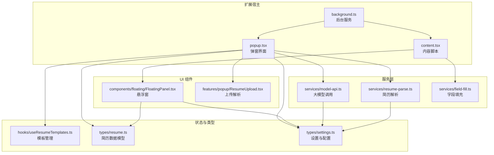
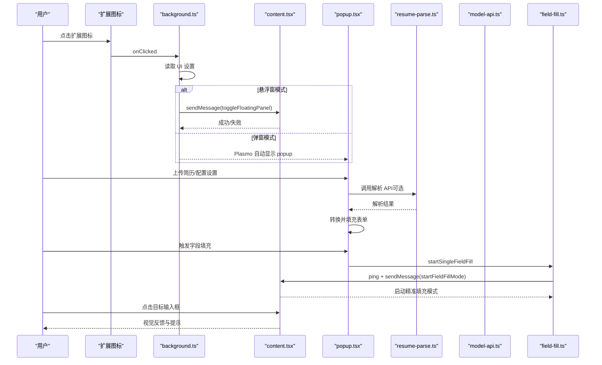
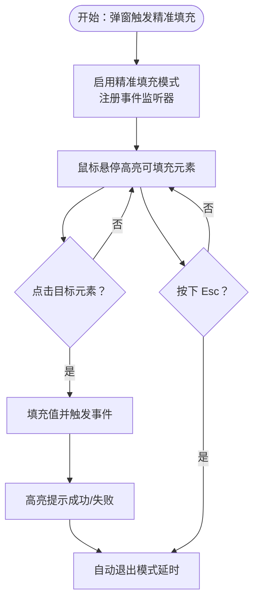
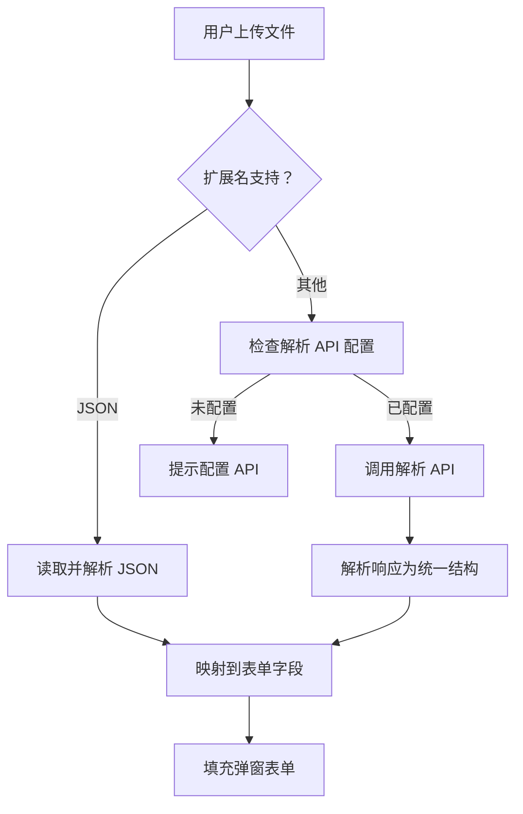
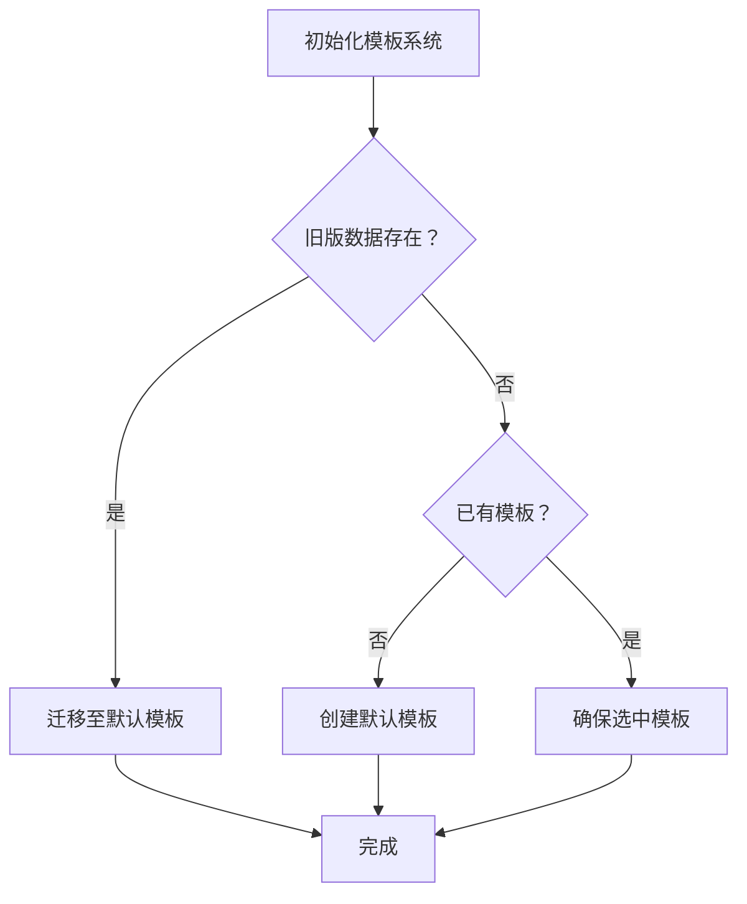
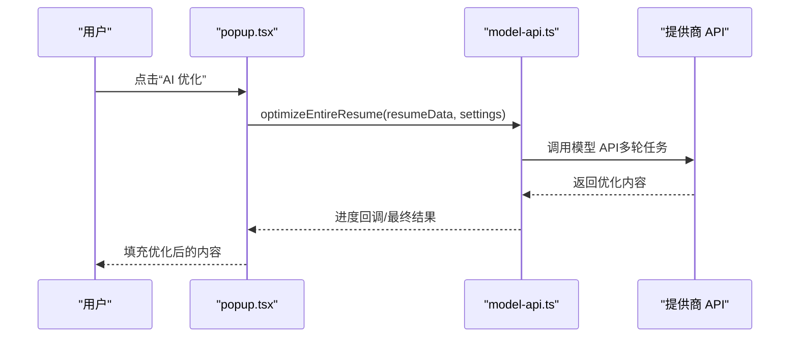
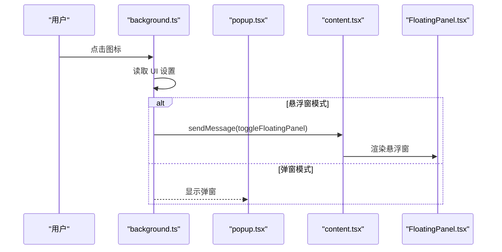
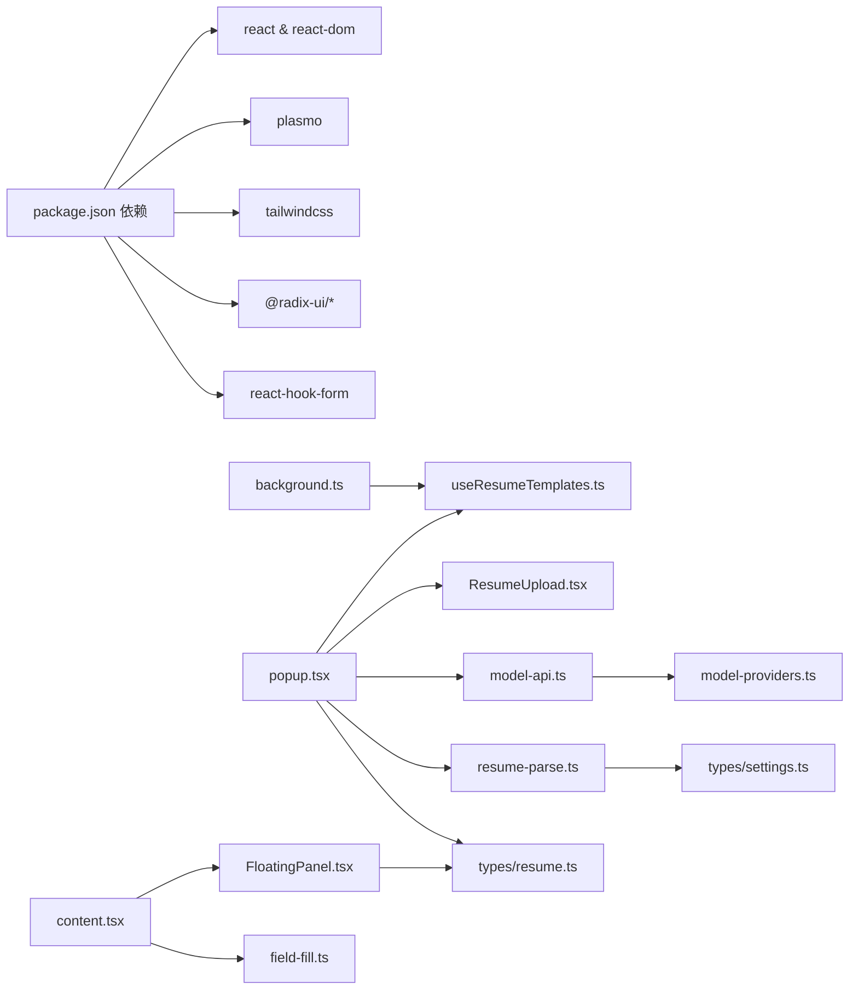

# 项目概述

<cite>
**本文引用的文件**
- [README.md](file://README.md)
- [package.json](file://package.json)
- [src/background.ts](file://src/background.ts)
- [src/content.tsx](file://src/content.tsx)
- [src/popup.tsx](file://src/popup.tsx)
- [src/services/resume-parse.ts](file://src/services/resume-parse.ts)
- [src/services/model-api.ts](file://src/services/model-api.ts)
- [src/services/field-fill.ts](file://src/services/field-fill.ts)
- [src/hooks/useResumeTemplates.ts](file://src/hooks/useResumeTemplates.ts)
- [src/features/popup/ResumeUpload.tsx](file://src/features/popup/ResumeUpload.tsx)
- [src/components/floating/FloatingPanel.tsx](file://src/components/floating/FloatingPanel.tsx)
- [src/config/model-providers.ts](file://src/config/model-providers.ts)
- [src/types/resume.ts](file://src/types/resume.ts)
- [src/types/settings.ts](file://src/types/settings.ts)
</cite>

## 目录
1. [简介](#简介)
2. [项目结构](#项目结构)
3. [核心组件](#核心组件)
4. [架构总览](#架构总览)
5. [详细组件分析](#详细组件分析)
6. [依赖关系分析](#依赖关系分析)
7. [性能考量](#性能考量)
8. [故障排查指南](#故障排查指南)
9. [结论](#结论)
10. [附录](#附录)

## 简介
Offer Laolao 插件是一个面向求职者的 Chrome 扩展，旨在通过“AI 驱动的简历解析 + 智能字段填充”提升在主流招聘网站填写表单的效率。它支持：
- 智能简历解析（PDF/DOCX/DOC/TXT/JSON），并自动映射到表单字段；
- 一键预填与“点选精准填充”两种模式；
- 多家国内大模型服务商接入，提供简历内容优化、自动生成介绍等 AI 功能；
- 多模板简历管理与导出（JSON/LaTeX）；
- 悬浮窗与弹窗双 UI 模式，满足不同使用习惯。

目标用户：
- 求职者：快速批量投递简历，减少重复录入；
- 开发者/技术用户：对自动化、可扩展性有更高要求，可通过多模板、多模型配置灵活定制。

核心价值主张：
- 一键预填：降低重复劳动；
- 字段级精确填充：覆盖复杂表单与特殊输入框；
- AI 优化：提升简历表达质量与匹配度；
- 多模板管理：隔离不同岗位/阶段的简历数据。

## 项目结构
项目采用 Plasmo 框架构建 Chrome Extension（Manifest V3），前端基于 React 18 + Tailwind CSS，核心目录划分如下：
- src/background.ts：后台服务脚本，处理扩展图标点击、UI 模式切换与 popup 行为；
- src/content.tsx：内容脚本，注入悬浮窗 UI、监听消息、实现字段级精准填充；
- src/popup.tsx：弹窗主界面，包含简历表单、上传解析、设置与导出；
- src/services/*：服务层，封装简历解析、模型 API、字段填充等；
- src/hooks/useResumeTemplates.ts：模板管理 Hook，负责多模板 CRUD、迁移与持久化；
- src/features/popup/* 与 src/components/*：弹窗与悬浮窗 UI 组件；
- src/config/model-providers.ts：大模型提供商配置；
- src/types/*：类型定义与默认值。

图表来源
- [src/background.ts](file://src/background.ts#L1-L80)
- [src/content.tsx](file://src/content.tsx#L1-L150)
- [src/popup.tsx](file://src/popup.tsx#L1-L120)
- [src/services/resume-parse.ts](file://src/services/resume-parse.ts#L1-L120)
- [src/services/model-api.ts](file://src/services/model-api.ts#L1-L120)
- [src/services/field-fill.ts](file://src/services/field-fill.ts#L1-L120)
- [src/hooks/useResumeTemplates.ts](file://src/hooks/useResumeTemplates.ts#L1-L80)
- [src/features/popup/ResumeUpload.tsx](file://src/features/popup/ResumeUpload.tsx#L1-L120)
- [src/components/floating/FloatingPanel.tsx](file://src/components/floating/FloatingPanel.tsx#L1-L120)
- [src/types/resume.ts](file://src/types/resume.ts#L1-L120)
- [src/types/settings.ts](file://src/types/settings.ts#L1-L120)

章节来源
- [README.md](file://README.md#L1-L120)
- [package.json](file://package.json#L1-L66)

## 核心组件
- 后台服务（background.ts）
  - 监听扩展图标点击，根据 UI 设置决定展示弹窗还是悬浮窗；
  - 通过 runtime 消息通道与内容脚本交互，动态切换 popup 行为；
  - 保持 UI 模式与悬浮窗可见状态的一致性。
- 内容脚本（content.tsx）
  - 注入悬浮窗 UI，支持拖拽、最小化、关闭；
  - 实现“字段级精准填充”模式：鼠标悬停高亮、点击目标输入框、自动触发事件、视觉反馈；
  - 通过事件与消息机制与弹窗/后台协作。
- 弹窗界面（popup.tsx）
  - 多标签页：简历填写、设置；
  - 模板选择器：切换/新增/重命名/复制/删除模板；
  - 上传解析：支持 JSON 直接导入与 API 解析；
  - 导出：JSON/LaTeX/AI 生成介绍/提示词导出。
- 服务层
  - 简历解析（resume-parse.ts）：Base64 编码、调用阿里云 API、统一数据结构；
  - 大模型 API（model-api.ts）：多提供商适配、连接测试、字段优化、AI 匹配；
  - 字段填充（field-fill.ts）：跨页面消息、Ping 检测、重试机制、安全校验。
- 模板管理（useResumeTemplates.ts）
  - 新老数据迁移、默认模板创建、CRUD 操作、自动时间戳更新；
  - 与浏览器存储联动，保证数据一致性。
- 类型与配置
  - 简历数据模型（types/resume.ts）：个人信息、求职期望、教育/工作/项目/技能/语言/自定义字段；
  - 设置与配置（types/settings.ts）：模型提供商、解析设置、UI 模式、悬浮窗位置；
  - 模型提供商（config/model-providers.ts）：DeepSeek、Kimi、Qwen、火山引擎、智谱、百川等。

章节来源
- [src/background.ts](file://src/background.ts#L1-L80)
- [src/content.tsx](file://src/content.tsx#L1-L150)
- [src/popup.tsx](file://src/popup.tsx#L1-L120)
- [src/services/resume-parse.ts](file://src/services/resume-parse.ts#L1-L120)
- [src/services/model-api.ts](file://src/services/model-api.ts#L1-L120)
- [src/services/field-fill.ts](file://src/services/field-fill.ts#L1-L120)
- [src/hooks/useResumeTemplates.ts](file://src/hooks/useResumeTemplates.ts#L1-L120)
- [src/types/resume.ts](file://src/types/resume.ts#L1-L120)
- [src/types/settings.ts](file://src/types/settings.ts#L1-L120)
- [src/config/model-providers.ts](file://src/config/model-providers.ts#L1-L120)

## 架构总览
整体采用“后台服务 + 内容脚本 + 弹窗界面”的三段式架构，配合服务层与状态管理，形成完整的简历解析与表单填充闭环。

图表来源
- [src/background.ts](file://src/background.ts#L1-L80)
- [src/content.tsx](file://src/content.tsx#L60-L122)
- [src/popup.tsx](file://src/popup.tsx#L120-L220)
- [src/services/resume-parse.ts](file://src/services/resume-parse.ts#L35-L120)
- [src/services/model-api.ts](file://src/services/model-api.ts#L1-L120)
- [src/services/field-fill.ts](file://src/services/field-fill.ts#L120-L220)

## 详细组件分析

### 组件 A：字段级精准填充（Point-and-Fill）
- 功能要点
  - 弹窗触发后，进入“精准填充模式”，页面光标变为十字准星；
  - 鼠标悬停高亮可填充元素（input/textarea/select/contenteditable 等）；
  - 点击目标元素即完成填充，并触发 input/change/blur 事件；
  - 支持 Esc 取消；填充后短暂高亮提示。
- 关键流程

图表来源
- [src/content.tsx](file://src/content.tsx#L155-L244)
- [src/content.tsx](file://src/content.tsx#L245-L395)
- [src/services/field-fill.ts](file://src/services/field-fill.ts#L120-L220)

章节来源
- [src/content.tsx](file://src/content.tsx#L155-L395)
- [src/services/field-fill.ts](file://src/services/field-fill.ts#L1-L120)

### 组件 B：简历解析与智能映射
- 功能要点
  - 支持 JSON 直接导入与 API 解析（PDF/DOCX/DOC/TXT/HTML）；
  - 统一解析结果结构，映射到简历各模块；
  - 日期标准化、技能等级映射、期望行业/地点补全。
- 关键流程

图表来源
- [src/features/popup/ResumeUpload.tsx](file://src/features/popup/ResumeUpload.tsx#L1-L120)
- [src/services/resume-parse.ts](file://src/services/resume-parse.ts#L35-L120)
- [src/services/resume-parse.ts](file://src/services/resume-parse.ts#L135-L295)

章节来源
- [src/features/popup/ResumeUpload.tsx](file://src/features/popup/ResumeUpload.tsx#L1-L120)
- [src/services/resume-parse.ts](file://src/services/resume-parse.ts#L1-L120)
- [src/services/resume-parse.ts](file://src/services/resume-parse.ts#L120-L220)

### 组件 C：多模板管理与迁移
- 功能要点
  - 支持创建/切换/重命名/复制/删除模板；
  - 自动迁移旧版单简历数据到新模板系统；
  - 默认模板创建与当前模板选中逻辑。
- 关键流程

图表来源
- [src/hooks/useResumeTemplates.ts](file://src/hooks/useResumeTemplates.ts#L35-L80)
- [src/hooks/useResumeTemplates.ts](file://src/hooks/useResumeTemplates.ts#L82-L120)
- [src/hooks/useResumeTemplates.ts](file://src/hooks/useResumeTemplates.ts#L120-L200)

章节来源
- [src/hooks/useResumeTemplates.ts](file://src/hooks/useResumeTemplates.ts#L1-L120)
- [src/types/resume.ts](file://src/types/resume.ts#L120-L212)

### 组件 D：AI 大模型集成与优化
- 功能要点
  - 支持多家提供商（DeepSeek、Kimi、Qwen、火山引擎、智谱、百川、自定义 OpenAI 兼容）；
  - 连接测试、字段优化（自我介绍、工作/项目描述、职责描述）、AI 匹配字段；
  - 一键优化整份简历，按进度回调。
- 关键流程

图表来源
- [src/services/model-api.ts](file://src/services/model-api.ts#L1-L120)
- [src/services/model-api.ts](file://src/services/model-api.ts#L290-L367)
- [src/services/model-api.ts](file://src/services/model-api.ts#L490-L678)
- [src/config/model-providers.ts](file://src/config/model-providers.ts#L1-L120)
- [src/types/settings.ts](file://src/types/settings.ts#L1-L120)

章节来源
- [src/services/model-api.ts](file://src/services/model-api.ts#L1-L120)
- [src/config/model-providers.ts](file://src/config/model-providers.ts#L1-L120)
- [src/types/settings.ts](file://src/types/settings.ts#L1-L120)

### 组件 E：UI 模式与悬浮窗
- 功能要点
  - 支持弹窗与悬浮窗两种模式，悬浮窗可拖拽、最小化、持久化位置；
  - 背景脚本根据 UI 设置动态调整 popup 行为；
  - 内容脚本负责悬浮窗渲染与精准填充模式。
- 关键流程

图表来源
- [src/background.ts](file://src/background.ts#L1-L80)
- [src/content.tsx](file://src/content.tsx#L1-L150)
- [src/components/floating/FloatingPanel.tsx](file://src/components/floating/FloatingPanel.tsx#L1-L120)

章节来源
- [src/background.ts](file://src/background.ts#L1-L80)
- [src/content.tsx](file://src/content.tsx#L1-L150)
- [src/components/floating/FloatingPanel.tsx](file://src/components/floating/FloatingPanel.tsx#L1-L120)

## 依赖关系分析
- 技术栈与选型
  - Plasmo：简化 Chrome Extension 开发，自动处理 content script 注入与打包；
  - React 18：组件化 UI，支持并发渲染与 Suspense；
  - Tailwind CSS：原子化样式，便于主题与响应式设计；
  - 类型系统：TypeScript 提供强类型约束，降低运行时风险；
  - 依赖管理：pnpm，减少包体积与安装时间。
- 外部集成
  - 阿里云简历解析 API：用于 PDF/DOCX 等文件解析；
  - 多家大模型 API：DeepSeek、Kimi、Qwen、火山引擎、智谱、百川、自定义 OpenAI 兼容；
  - 浏览器权限：storage、activeTab、scripting。
- 潜在耦合与风险
  - 内容脚本与弹窗之间的消息传递需考虑端口关闭、页面刷新等异常；
  - 大模型 API 的限流与鉴权错误需友好提示；
  - 悬浮窗位置与最小化状态需持久化，避免用户丢失。

图表来源
- [package.json](file://package.json#L1-L66)
- [src/background.ts](file://src/background.ts#L1-L80)
- [src/popup.tsx](file://src/popup.tsx#L1-L120)
- [src/content.tsx](file://src/content.tsx#L1-L150)
- [src/services/resume-parse.ts](file://src/services/resume-parse.ts#L1-L120)
- [src/services/model-api.ts](file://src/services/model-api.ts#L1-L120)
- [src/services/field-fill.ts](file://src/services/field-fill.ts#L1-L120)
- [src/hooks/useResumeTemplates.ts](file://src/hooks/useResumeTemplates.ts#L1-L120)
- [src/features/popup/ResumeUpload.tsx](file://src/features/popup/ResumeUpload.tsx#L1-L120)
- [src/components/floating/FloatingPanel.tsx](file://src/components/floating/FloatingPanel.tsx#L1-L120)
- [src/config/model-providers.ts](file://src/config/model-providers.ts#L1-L120)
- [src/types/resume.ts](file://src/types/resume.ts#L1-L120)
- [src/types/settings.ts](file://src/types/settings.ts#L1-L120)

章节来源
- [package.json](file://package.json#L1-L66)
- [src/types/settings.ts](file://src/types/settings.ts#L1-L120)

## 性能考量
- 字段填充性能
  - 事件监听器在模式开启时注册，关闭时清理，避免常驻开销；
  - 填充后高亮提示使用定时器回收，避免内存泄漏。
- 网络请求
  - 简历解析与大模型调用均采用一次性请求，必要时进行连接测试；
  - 一键优化整份简历时增加延迟，避免触发限流。
- UI 渲染
  - React 18 并发渲染，悬浮窗与弹窗均限制最大高度与滚动容器，避免长表单卡顿；
  - Tailwind 原子类减少样式计算复杂度。
- 存储与迁移
  - 模板系统在初始化阶段完成迁移与默认模板创建，避免后续每次操作都做判断。

[本节为通用指导，不直接分析具体文件]

## 故障排查指南
- 无法启动精准填充
  - 检查页面是否支持注入（chrome://、edge://、about: 等系统页不支持）；
  - 若弹窗快速关闭导致消息端口关闭，刷新页面后重试；
  - 确认内容脚本已加载（ping 检测）。
- 简历解析失败
  - 确认解析 API URL 与 APP Code 已配置；
  - 检查网络连通与鉴权（401/429/400 等错误）。
- 大模型调用失败
  - 检查对应提供商 API Key 是否配置；
  - 使用“连接测试”验证可用性；
  - 注意限流与温度/Token 参数设置。
- 悬浮窗位置丢失
  - 检查 UI 设置中的悬浮窗位置与最小化状态是否持久化；
  - 如需恢复默认，可在设置中重置。

章节来源
- [src/services/field-fill.ts](file://src/services/field-fill.ts#L120-L220)
- [src/services/resume-parse.ts](file://src/services/resume-parse.ts#L82-L120)
- [src/services/model-api.ts](file://src/services/model-api.ts#L140-L175)
- [src/types/settings.ts](file://src/types/settings.ts#L85-L120)

## 结论
Offer Laolao 插件通过“AI 驱动的简历解析 + 智能字段填充”，有效缩短了求职者在招聘网站上的表单填写时间，提升了简历质量与匹配度。其采用的 Plasmo + React 18 + Tailwind 架构，既保证了开发效率，也兼顾了扩展性与可维护性。多模板管理与多模型集成进一步增强了灵活性，适合不同层次用户的需求。

[本节为总结性内容，不直接分析具体文件]

## 附录
- 安装与使用
  - 开发者模式安装、Edge 商店安装、Edge 开发者模式加载；
  - 配置 API（可选但推荐）、模板管理、上传解析、AI 优化、导出备份。
- 支持网站
  - 理论上支持所有招聘网站，若自动识别失败，可使用“字段级精准填充”。

章节来源
- [README.md](file://README.md#L130-L330)